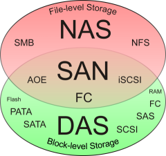
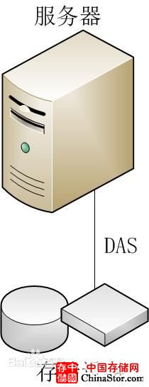
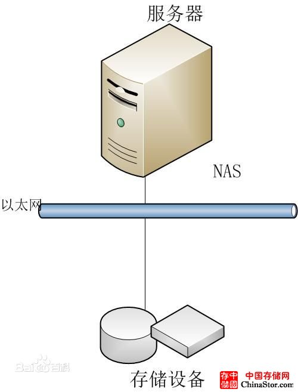
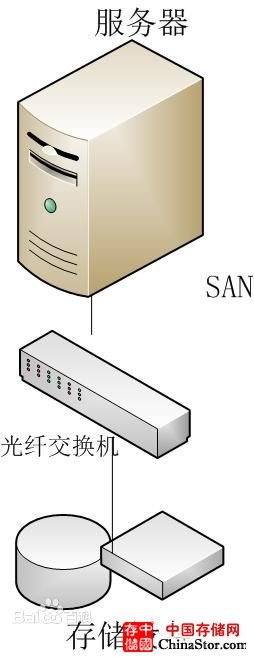
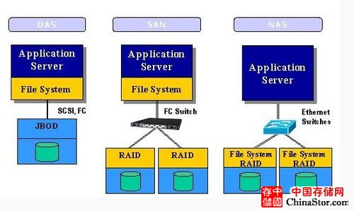

# [明晰三种常见存储技术：DAS、SAN和NAS](https://www.cnblogs.com/mjorcen/p/3974242.html)

　随着主机、磁盘、网络等技术的发展，数据存储的方式和架构也在一直不停改变，本文主要介绍目前主流的存储架构。

### 存储的分类

#### 根据服务器类型分为：

封闭系统的存储（封闭系统主要指大型机）
开放系统的存储（开放系统指基于Windows、UNIX、Linux等操作系统的服务器）
开放系统的存储分为：`内置存储`和`外挂存储`；

外挂存储根据连接的方式分为：`直连式存储`（Direct-Attached Storage，简称DAS）和`网络化存储`（Fabric-Attached Storage，简称FAS）；

网络化存储根据传输协议又分为：`网络接入存储`（Network-Attached Storage，简称NAS）和`存储区域网络`（Storage Area Network，简称SAN）。看下图，可以清晰的理解刚才的描述。

 

 

常见三种存储架构 DAS、NAS、SAN比较，区别说明：

 

 

 

DAS存储 （直连式存储Direct-Attached Storage）

 

 

DAS存储在我们生活中是非常常见的，尤其是在中小企业应用中，DAS是最主要的应用模式，存储系统被直连到应用的服务器中，在中小企业中，许多的数据应用是必须安装在直连的DAS存储器上。

DAS存储更多的依赖服务器主机操作系统进行数据的IO读写和存储维护管理，数据备份和恢复要求占用服务器主机资源（包括CPU、系统IO等），数据流需要回流主机再到服务器连接着的磁带机（库），数据备份通常占用服务器主机资源20-30%，因此许多企业用户的日常数据备份常常在深夜或业务系统不繁忙时进行，以免影响正常业务系统的运行。直连式存储的数据量越大，备份和恢复的时间就越长，对服务器硬件的依赖性和影响就越大。

直连式存储与服务器主机之间的连接通道通常采用SCSI连接，随着服务器CPU的处理能力越来越强，存储硬盘空间越来越大，阵列的硬盘数量越来越多，SCSI通道将会成为IO瓶颈；服务器主机SCSI ID资源有限，能够建立的SCSI通道连接有限。

无论直连式存储还是服务器主机的扩展，从一台服务器扩展为多台服务器组成的群集(Cluster)，或存储阵列容量的扩展，都会造成业务系统的停机，从而给企业带来经济损失，对于银行、电信、传媒等行业7×24小时服务的关键业务系统，这是不可接受的。并且直连式存储或服务器主机的升级扩展，只能由原设备厂商提供，往往受原设备厂商限制。

NAS存储 （网络接入存储Network-Attached Storage）

 

 

NAS存储也通常被称为附加存储，顾名思义，就是存储设备通过标准的网络拓扑结构(例如以太网)添加到一群计算机上。NAS是文件级的存储方法，它的重点在于帮助工作组和部门级机构解决迅速增加存储容量的需求。如今用户采用NAS较多的功能是用来文档共享、图片共享、电影共享等等，而且随着云计算的发展，一些NAS厂商也推出了云存储功能，大大方便了企业和个人用户的使用。

NAS产品是真正即插即用的产品。NAS设备一般支持多计算机平台，用户通过网络支持协议可进入相同的文档，因而NAS设备无需改造即可用于混合Unix/Windows NT局域网内，同时NAS的应用非常灵活。

但NAS又一个关键性问题，即备份过程中的带宽消耗。与将备份数据流从LAN中转移出去的存储区域网（SAN）不同，NAS仍使用网络进行备份和恢复。NAS 的一个缺点是它将存储事务由并行SCSI连接转移到了网络上。这就是说LAN除了必须处理正常的最终用户传输流外，还必须处理包括备份操作的存储磁盘请求。

SAN存储 （存储区域网络Storage Area Network）

 

 

存储区域网络，从名字上我们也可以看出，这个是通过光纤通道交换机连接存储阵列和服务器主机，最后成为一个专用的存储网络。SAN经过十多年历史的发展，已经相当成熟，成为业界的事实标准（但各个厂商的光纤交换技术不完全相同，其服务器和SAN存储有兼容性的要求）。

SAN提供了一种与现有LAN连接的简易方法，并且通过同一物理通道支持广泛使用的SCSI和IP协议。SAN不受现今主流的、基于SCSI存储结构的布局限制。特别重要的是，随着存储容量的爆炸性增长，SAN允许企业独立地增加它们的存储容量。SAN的结构允许任何服务器连接到任何存储阵列，这样不管数据置放在那里，服务器都可直接存取所需的数据。因为采用了光纤接口，SAN还具有更高的带宽。

如今的SAN解决方案通常会采取以下两种形式：光纤信道以及iSCSI或者基于IP的SAN，也就是FC SAN和IP SAN。光纤信道是SAN解决方案中大家最熟悉的类型，但是，最近一段时间以来，基于iSCSI的SAN解决方案开始大量出现在市场上，与光纤通道技术相比较而言，这种技术具有良好的性能，而且价格低廉。

SAN真正的综合了DAS和NAS两种存储解决方案的优势。例如，在一个很好的SAN解决方案实现中，你可以得到一个完全冗余的存储网络，这个存储网络具有不同寻常的扩展性，确切地说，你可以得到只有NAS存储解决方案才能得到的几百T字节的存储空间，但是你还可以得到块级数据访问功能，而这些功能只能在DAS解决方案中才能得到。对于数据访问来说，你还可以得到一个合理的速度，对于那些要求大量磁盘访问的操作来说，SAN显得具有更好的性能。利用SAN解决方案，你还可以实现存储的集中管理，从而能够充分利用那些处于空闲状态的空间。更有优势的一点是，在某些实现中，你甚至可以将服务器配置为没有内部存储空间的服务器，要求所有的系统都直接从SAN（只能在光纤通道模式下实现）引导。这也是一种即插即用技术。

SAN确实具有这些伟大的优点，那么，SAN的缺陷在哪里？SAN有两个较大的缺陷：成本和复杂性，特别是在光纤信道中这些缺陷尤其明显。使用光纤信道的情况下，合理的成本大约是1TB或者2TB大概需要五万到六万美金。从另一个角度来看，虽然新推出的基于iSCSI的SAN解决方案大约只需要两万到三万美金，但是其性能却无法和光纤信道相比较。在价格上的差别主要是由于iSCSI技术使用的是现在已经大量生产的吉比特以太网硬件，而光纤通道技术要求特定的价格昂贵的设备。

因为SAN解决方案是从基本功能剥离出存储功能，所以运行备份操作就无需考虑它们对网络总体性能的影响。SAN方案也使得管理及集中控制实现简化，特别是对于全部存储设备都集群在一起的时候。最后一点，光纤接口提供了10公里的连接长度，这使得实现物理上分离的、不在机房的存储变得非常容易。

总结：最后概括一下就是，DAS存储一般应用在中小企业，与计算机采用直连方式，NAS存储则通过以太网添加到计算机上，SAN存储则使用FC接口，提供性能更加的存储。

SAN与NAS的主要区别体现在操作系统在什么位置，如下图所示：

 

 

如今，随着移动计算时代的来临，更多的非结构化数据产生，这对NAS和SAN都是一个挑战，NAS+SAN将是未来主要的存储解决方案，也就是目前比较热门的统一存储。既然是一个集中化的磁盘阵列，那么就支持主机系统通过IP网络进行文件级别的数据访问，或通过光纤协议在SAN网络进行块级别的数据访问。同样，iSCSI亦是一种非常通用的IP协议，只是其提供块级别的数据访问。这种磁盘阵列配置多端口的存储控制器和一个管理接口，允许存储管理员按需创建存储池或空间，并将其提供给不同访问类型的主机系统。

统一存储系统：前端主机接口可支持FC 8Gb、iSCSI 1Gb和iSCSI 10Gb，后端具备SAS 6Gb硬盘扩展接口，可支持SAS、SATA硬盘及SSD固态硬盘具备极佳的扩展能力。实现FC SAN与IP SAN、各类存储介质的完美融合，有效整合用户现有存储网络架构，实现高性能SAN网络的统一部署和集中管理，以适应业务和应用变化的动态需求。主机接口及硬盘接口均采用模块化设计，更换主机接口或硬盘扩展接口，无须更换固件，可大大简化升级维护的难度和工作量。

应用场景

DAS虽然比较古老了，但是还是很适用于那些数据量不大，对磁盘访问速度要求较高的中小企业；

NAS多适用于文件服务器，用来存储非结构化数据，虽然受限于以太网的速度，但是部署灵活，成本低；

SAN则适用于大型应用或数据库系统，缺点是成本高、较复杂。