# 一、MongoDB 入门篇


## 1.1 数据库管理系统

​                                                            

　　　　在了解MongoDB之前需要先了解先数据库管理系统

### 1.1.1 什么是数据？

　　数据（英语：data），是指未经过处理的原始记录。

　　一般而言，数据缺乏组织及分类，无法明确的表达事物代表的意义，它可能是一堆的杂志、一大叠的报纸、数种的开会记录或是整本病人的病历纪录。数据描述事物的符号记录，是可定义为意义的实体，涉及事物的存在形式。是关于事件之一组离散且客观的事实描述，是构成讯息和知识的原始材料。

### 1.1.2 什么是数据库管理系统？

　　数据库管理系统（英语：database management system，缩写：DBMS） 是一种针对对象数据库，为管理数据库而设计的大型电脑软件管理系统。

　　具有代表性的数据管理系统有：Oracle、Microsoft SQL Server、Access、MySQL及PostgreSQL等。通常DBA会使用数据库管理系统来创建数据库系统。

　　现代DBMS使用不同的数据库模型追踪实体、属性和关系。在个人电脑、大型计算机和主机上应用最广泛的数据库管理系统是关系型DBMS（relational DBMS）。在关系型数据模型中，用二维表格表示数据库中的数据。这些表格称为关系。

　　数据库管理系统主要分为俩大类：RDBMS、NOSQL

### 1.1.3 常见数据库管理系统

常见的数据库管理系统，及其排名情况如下：

​                                                        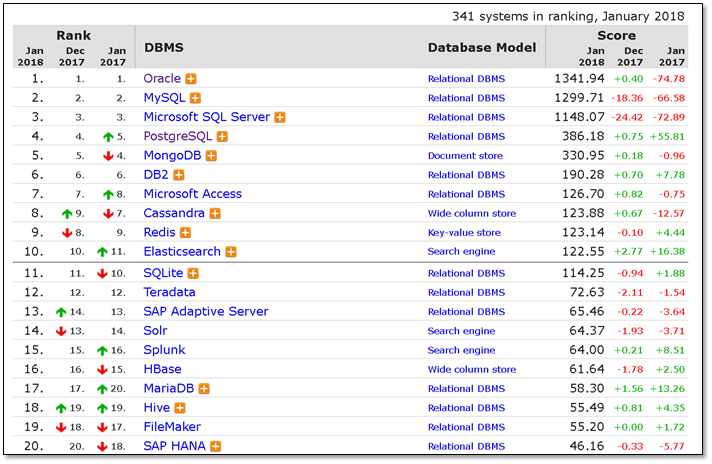

图 - 数据库管理系统使用情况世界排名

数据来源：<https://db-engines.com/en/ranking>

## 1.2 NoSQL是什么？

### 1.2.1 NoSQL 简介

　　NoSQL是对不同于传统的关系数据库的数据库管理系统的统称。

　　两者存在许多显著的不同点，其中最重要的是NoSQL不使用SQL作为查询语言。其数据存储可以不需要固定的表格模式，也经常会避免使用SQL的JOIN操作，`一般有水平可扩展性的特征`。

　　NoSQL一词**最早出现于1998年**，是Carlo Strozzi开发的一个轻量、开源、不提供SQL功能的关系数据库。

　　**2009年**，Last.fm的Johan Oskarsson发起了一次关于分布式开源数据库的讨论，来自Rackspace的**Eric Evans**再次提出了NoSQL的概念，这时的NoSQL主要指非关系型、分布式、不提供ACID的数据库设计模式。

　　2009年在亚特兰大举行的"no:sql(east)"讨论会是一个里程碑，其口号是"select fun, profit from real_world where relational=false;"。因此，对NoSQL最普遍的解释是“非关联型的”，强调Key-Value Stores和文档数据库的优点，而不是单纯的反对RDBMS。

　　基于2014年的收入，NoSQL市场领先企业是MarkLogic，MongoDB和Datastax。基于2015年的人气排名，最受欢迎的NoSQL数据库是**MongoDB**，Apache Cassandra和Redis.

### 1.2.2 NoSQL数据库四大家族

NoSQL中的四大家族主要是：`列存储`、`键值`、`图像存储`、`文档存储`，其类型产品主要有以下这些。

| **存储类型**       | **NoSQL**                                                    |                                                      |
| ------------------ | ------------------------------------------------------------ | ---------------------------------------------------- |
| **键值存储**       | **`最终一致性`键值存储**                                     | Cassandra、Dynamo、Riak、Hibari、Virtuoso、Voldemort |
| **内存键值存储**   | Memcached、Redis、Oracle Coherence、NCache、 Hazelcast、Tuple space、Velocityx |                                                      |
| **持久化键值存储** | BigTable、LevelDB、Tokyo Cabinet、Tarantool、TreapDB、Tuple space |                                                      |
| **文档存储**       | MongoDB、CouchDB、SimpleDB、 Terrastore 、 BaseX 、Clusterpoint 、 Riak、No2DB |                                                      |
| **图存储**         | FlockDB、DEX、Neo4J、AllegroGraph、InfiniteGraph、OrientDB、Pregel |                                                      |
| **列存储**         | Hbase、Cassandra、Hypertable                                 |                                                      |

### 1.2.3 NoSQL的优势

　　高可扩展性、分布式计算、没有复杂的关系、低成本

　　架构灵活、半结构化数据

### 1.2.4 NoSQL 与 RDBMS 对比 

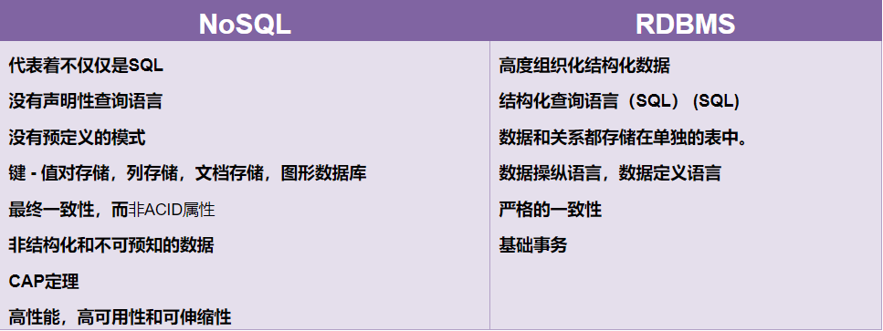

## 1.3 MongoDB简介

### 1.3.1 MongoDB是什么

​                                                                                                  

　　　　MongoDB并非芒果的意思，而是源于 Humongous（巨大）一词。

### 1.3.2 MongoDB的特性

　　MongoDB的3大技术特色如下所示：

​                                                                      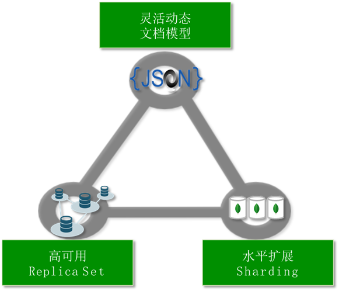

除了上图所示的还**支持**：

　　二级索引、动态查询、全文搜索 、聚合框架、MapReduce、GridFS、地理位置索引、内存引擎 、地理分布等一系列的强大功能。

```shell
`GridFS`是一种将大型文件存储,是MongoDB的文件规范。所有官方支持的驱动均实现了GridFS规范
```

但是其也有些许的**缺点**，例如：

> 　　多表关联： 仅仅支持 Left Outer Join
>
> 　　SQL 语句支持： 查询为主，部分支持
>
> 　　多表原子事务： 不支持
>
> 　　多文档原子事务：不支持
>
> 　　16 MB 文档大小限制，不支持中文排序 ，服务端 Javascript 性能欠佳

```shell
`原子性`：
     表示组成一个事务的多个数据库操作是一个不可分割的原子单元，只有所有的操作执行成功，整个事务才提交。事务中的任何一个数据库操作失败，已经执行的任何操作都必须被撤销，让数据库返回初始状态。

`一致性`
     事务操作成功后，数据库所处的状态和他的业务规则是一致的，即数据不会被破坏。如A账户转账100元到B账户，不管操作成功与否，A和B账户的存款总额是不变的。

`隔离性`
     在并发数据操作时，不同的事务拥有各自的数据空间，他们的操作不会对对方产生`敢逃`。准确地说，并非要求做到完全无干扰。数据库规定了多种事务隔离界别，不同的隔离级别对应不用的干扰程度，隔离级别越高，数据一致性越好，但并发行越弱。

`持久性`：
     一旦事务提交成功后，事务中所有的数据操作都必须被持久化到数据库中。即使在事务提交后，数据库马上崩溃，在数据库重启时，也必须保证能够通过某种机制恢复数据。
```

### 1.3.3 关系型数据库与 mongodb 对比

**1、存储方式对比**

​     在传统的关系型数据库中，存储方式是以表的形式存放，而在MongoDB中，以文档的形式存在。

​                                                                      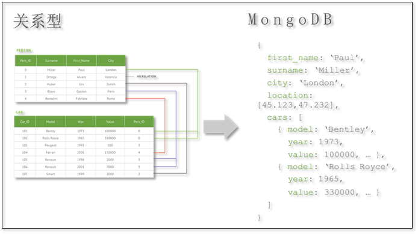 

   数据库中的对应关系，及存储形式的说明

​                                                                    

MongoDB与SQL的结构对比详解

| **SQL Terms/Concepts**                                       | **MongoDB Terms/Concepts**                                   |
| ------------------------------------------------------------ | ------------------------------------------------------------ |
| **database**                                                 | database                                                     |
| **table**                                                    | collection                                                   |
| **row**                                                      | JSON document  or BSON document                              |
| **column**  (列)                                             | field （数据字段/域）                                        |
| **index**                                                    | index                                                        |
| **table joins**  （表联接）                                  | embedded documents and linking （嵌入式文档和链接）          |
| **primary key Specify any unique column or column combination as primary key.** （将任何唯一的列或列组合为主键） | primary keyIn MongoDB, the primary key isautomatically set to the id field. （主键在MongoDB中，主键自动设置为_id字段） |
| **aggregation (e.g. group by)** （聚合（例如分组依据））     | aggregation pipelineSee the SQL to Aggregation MappingChart.（聚合管道查看SQL到聚合映射图表） |

### 1.3.4 MongoDB数据存储格式

**JSON格式**

　　JSON 数据格式与语言无关，脱胎于 JavaScript，但目前很多编程语言都支持 JSON 格式数据的生成和解析。JSON 的官方 MIME 类型是` application/json`，文件扩展名是 .json。

　　MongoDB 使用JSON（JavaScript ObjectNotation）文档存储记录。

　　JSON数据库语句可以容易被解析。

　　Web 应用大量使用，NAME-VALUE 配对

​                                                                        

**BSON格式**

　　BSON是由10gen开发的一个数据格式，目前主要用于MongoDB中，是MongoDB的数据存储格式。BSON基于JSON格式，选择JSON进行改造的原因主要是JSON的通用性及JSON的schemaless的特性。 

　　二进制的JSON，JSON文档的二进制编码存储格式

　　BSON有JSON没有的Date和BinData

　　MongoDB中document以BSON形式存放

例如：

```
> db.meeting.insert({meeting:“M1 June",Date:"2018-01-06"});
```

### 1.3.5 MongoDB的优势

 　　 📢 MongoDB 是开源产品

 　　 📢 On GitHub Url：https://github.com/mongodb

 　 　📢  Licensed under the AGPL，有开源的社区版本

 　　 📢 起源& 赞助by MongoDB公司，提供商业版licenses 许可

   　　这些优势造就了mongodb的丰富的功能：

　　JSON 文档模型、动态的数据模式、二级索引强大、查询功能、自动分片、水平扩展、自动复制、高可用、文本搜索、企业级安全、聚合框架、MapReduce、大文件存储GridFS

### 1.3.6 高可用的复制集群

　　`自动复制和故障切换`

　　多数据中心支持滚动维护无需关机支持最多50个成员

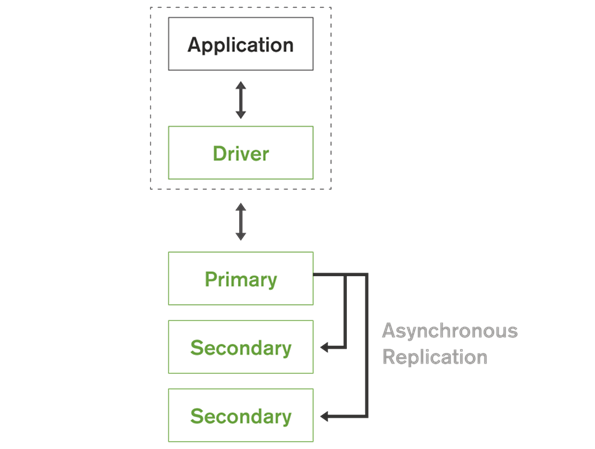

### 1.3.7 水平扩展

　　这种方式是目前构架上的主流形式，指的是`通过增加服务器数量来对系统扩容`。在这样的构架下，单台服务器的配置并不会很高，可能是配置比较低、很廉价的 PC，每台机器承载着系统的一个子集，所有机器服务器组成的集群会比单体服务器提供更强大、高效的系统容载量。

​                                                               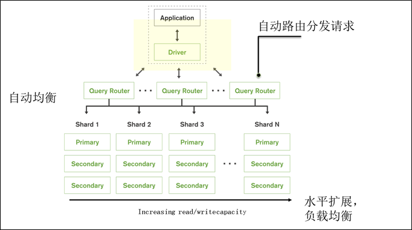 

　　这样的问题是系统构架会比单体服务器复杂，搭建、维护都要求更高的技术背景。分片集群架构如下图所示：

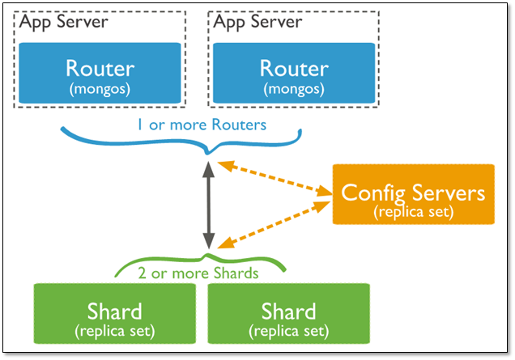

### 1.3.8 各存储引擎的对比

|                          | **MySQL InnoDB** | **MySQL NDB** | **Oracle** | **MongoDB MAPI** | **MongoDB WiredTiger** |
| ------------------------ | ---------------- | ------------- | ---------- | ---------------- | ---------------------- |
| 事务                     | YES              | YES           | ES         | NO               | NO                     |
| 锁粒度                   | ROW-level        | ROW-level     | ROW-level  | Collection-level | Document-level         |
| Geospatial （空间）      | YES              | YES           | YES        | YES              | YES                    |
| MVCC  （多版本并发控制） | YES              | NO            | YES        | NO               | NO                     |
| Replication              | YES              | YES           | YES        | YES              | YES                    |
| 外键                     | YES              | YES(From 7.3) | YES        | NO               | NO                     |
| 数据库集群               | NO               | YES           | YES        | YES              | YES                    |
| B-TREE索引               | YES              | YES           | YES        | YES              | YES                    |
| 全文检索                 | YES              | NO            | YES        | YES              | YES                    |
| 数据压缩                 | YES              | NO            | YES        | NO               | YES                    |
| 存储限制                 | 64TB             | 384EB         | NO         | NO               | NO                     |
| 表分区                   | YES              | YES           | YES        | YES **(**分片)   | YES **(**分片**)**     |

### 1.3.9 数据库功能和性能对比

　　由下图可以看出 MongoDB 数据库的性能扩展能力及功能都较好，都能够在数据库中，站立一足之地。

​                                                           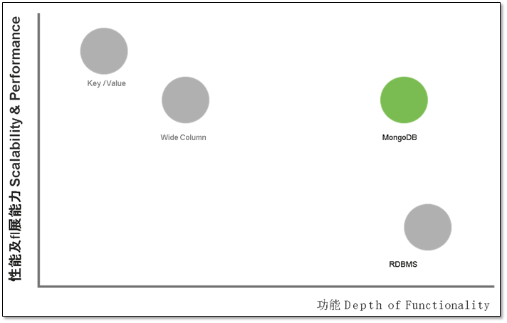 

### 1.3.10 MongoDB适用场景

　　网站数据、缓存等大尺寸、低价值的数据

　　在高伸缩性的场景，用于对象及JSON数据的存储。


### 1.3.11 MongoDB 慎用场景

| **慎用场景**                                                 | **原因**                                                     |
| ------------------------------------------------------------ | ------------------------------------------------------------ |
| **PB** **数据持久存储大数据分析数据湖**                      | Hadoop、Spark提供更多分析运算功能和工具，并行计算能力更强MongoDB + Hadoop/Spark |
| **搜索场景：文档有几十个字段，需要按照任意字段搜索并排序限制等** | 不建索引查询太慢，索引太多影响写入及更新操作                 |
| **ERP、CRM或者类似复杂应用，几十上百个对象互相关联**         | 关联支持较弱，事务较弱                                       |
| **需要参与远程事务，或者需要跨表，跨文档原子性更新的**       | MongoDB  事务支持仅限于本机的单文档事务                      |
| **100%** **写可用：任何时间写入不能停**                      | MongoDB 换主节点时候会有短暂的不可写设计所限                 |

### 1.3.12 什么时候该用MongDB 

| 应用特征                               | **Yes/No?** |
| -------------------------------------- | ----------- |
| 我的数据量是有亿万级或者需要不断扩容   |             |
| 需要2000-3000以上的读写每秒            |             |
| 新应用，需求会变，数据模型无法确定     |             |
| 我需要整合多个外部数据源               |             |
| 我的系统需要99.999%高可用              |             |
| 我的系统需要大量的地理位置查询         |             |
| 我的系统需要提供最小的 latency（延迟） |             |
| 我要管理的主要数据对象 <10             |             |

　　在上面的表格中进行选择，但有1个yes的时候：可以考虑MongoDB；当有2个以上yes的时候：不会后悔的选择

## 1.4 MongoDB 的部署

　　MongoDB官网：<https://www.mongodb.com/>

　　CentOS6.X版本软件下载地址：<https://www.mongodb.org/dl/linux/x86_64-rhel62>

　　其他版本请到进行官网下载。

### 1.4.1 安装前准备

　　在安装之前首先确认该版本软件是否支持你的操作系统。

　　　　更多详情查看：<https://docs.mongodb.com/manual/installation/> 

| **Platform**                  | **3.6 Community & Enterprise** | **3.4 Community & Enterprise** | **3.2 Community & Enterprise** | **3.0 Community & Enterprise** |
| ----------------------------- | ------------------------------ | ------------------------------ | ------------------------------ | ------------------------------ |
| **RHEL/CentOS 6.2 and later** | ✓                              | ✓                              | ✓                              | ✓                              |
| **RHEL/CentOS 7.0 and later** | ✓                              | ✓                              | ✓                              | ✓                              |

### 1.4.2 环境说明

**系统环境说明：**

```
[root@MongoDB ~]# cat /etc/redhat-release 
CentOS release 6.9 (Final)
[root@MongoDB ~]# uname -r
2.6.32-696.el6.x86_64
[root@MongoDB ~]# /etc/init.d/iptables status
iptables: Firewall is not running.
[root@MongoDB ~]# getenforce 
Disabled
[root@MongoDB ~]# hostname -I
10.0.0.152 172.16.1.152
```

**软件版本说明**

```
本次使用的mongodb版本为：mongodb-linux-x86_64-3.2.8.tgz
```

### 1.4.3 部署MongoDB

在root用户下操作

```shell
cat >> /etc/rc.local <<'EOF'
if test -f /sys/kernel/mm/transparent_hugepage/enabled; then
  echo never > /sys/kernel/mm/transparent_hugepage/enabled
fi
if test -f /sys/kernel/mm/transparent_hugepage/defrag; then
   echo never > /sys/kernel/mm/transparent_hugepage/defrag
fi
EOF
```

　　该方法仅限与CentOS系统使用，其他系统关闭参照官方文档：   　　　　　　<https://docs.mongodb.com/manual/tutorial/transparent-huge-pages/>

　　Transparent Huge Pages (THP)，通过使用更大的内存页面，可以减少具有大量内存的机器上的缓冲区（TLB）查找的开销。

　　但是，数据库工作负载通常对THP表现不佳，因为它们往往具有稀疏而不是连续的内存访问模式。您应该在Linux机器上禁用THP，以确保MongoDB的最佳性能。

**创建用户**

```bash
groupadd -g 800 mongod
useradd  -u 801 -g mongod  mongod
```

　修改用户密码

```bash
echo 123456 |passwd --stdin  mongod
```

**创建程序目录**

```bash
mkdir -p /application/mongodb/   &&\
cd  /application/mongodb/   &&\
mkdir  -p  bin  conf  log  data
```

**下载程序**

```bash
cd  /application/mongodb/
wget http://downloads.mongodb.org/linux/mongodb-linux-x86_64-rhel62-3.2.8.tgz
```

**解压程序**

```bash
tar xf  mongodb-linux-x86_64-3.2.8.tgz
cd mongodb-linux-x86_64-3.2.8/bin/ &&\
cp * /mongodb/bin
```

**修改程序属主**

```bash
chown -R mongod:mongod /application/mongodb
```

　　切换到mongod用户，设置用户环境变量

```bash
su - mongod
cat >> .bash_profile <<'EOF'
export PATH=/mongodb/bin:$PATH
EOF
source .bash_profile
```

　　   **至此，MongoDB数据库部署完成**

### 1.4.4 管理MongoDB

　　数据库的启动与关闭

```bash
启动：mongod --dbpath=/application/mongodb/data --logpath=/application/mongodb/log/mongodb.log --port=27017 --logappend --fork
关闭：mongod --shutdown  --dbpath=/application/mongodb/data --logpath=/application/mongodb/log/mongodb.log --port=27017 --logappend --fork
```

   参数说明: 

| **参数**        | **参数说明**                       |
| --------------- | ---------------------------------- |
| **--dbpath**    | 数据存放路径                       |
| **--logpath**   | 日志文件路径                       |
| **--logappend** | 日志输出方式                       |
| **--port**      | 启用端口号                         |
| **--fork**      | 在后台运行                         |
| **--auth**      | 是否需要验证权限登录(用户名和密码) |
| **--bind_ip**   | 限制访问的ip                       |
| **--shutdown**  | 关闭数据库                         |

登入数据库

```bash
[mongod@MongoDB ~]$ mongo
MongoDB shell version: 3.2.8
connecting to: test
>
```

使用配置文件的方式管理数据库：

　　**普通格式配置文件：**

```bash
cd /application/mongodb/conf/
[mongod@MongoDB conf]$ vim mongod1.conf 
dbpath=/application/mongodb/data
logpath=/application/mongodb/log/mongodb.log
port=27017
logappend=1
fork=1
```

   使用配置文件时的启动与关闭：

```bash
启动：mongod -f mongod1.conf 
关闭：mongod -f mongod1.conf  --shutdown
```

　　**YAML格式配置文件（3.X版本官方推荐使用）**

```bash
[mongod@MongoDB conf]$ cat  mongod.conf 
systemLog:
   destination: file
   path: "/application/mongodb/log/mongod.log"
   logAppend: true
storage:
   journal:
      enabled: true
   dbPath: "/application/mongodb/data"
processManagement:
   fork: true
net:
   port: 27017
```

在数据库中关闭数据库的方法

```bash
shell > mongo
[mongod@MongoDB conf]$ mongo
MongoDB shell version: 3.2.8
connecting to: test
> db.shutdownServer()
shutdown command only works with the admin database; try 'use admin'
> use admin
> db.shutdownServer()
server should be down...
```

注：

> mongod进程收到SIGINT信号或者SIGTERM信号，会做一些处理
>
> ```
> 2 SIGINT
> 程序终止(interrupt)信号, 在用户键入INTR字符(通常是Ctrl-C)时发出，用于通知前台进程组终止进程。
> 
> 15 SIGTERM 
> 程序结束(terminate)信号, 与SIGKILL不同的是该信号可以被阻塞和处理。通常用来要求程序自己正常退出，shell命令kill缺省产生这个信号。如果进程终止不了，我们才会尝试SIGKILL。
> ```
>
> \> 关闭所有打开的连接
>
> \> 将内存数据强制刷新到磁盘
>
> \> 当前的操作执行完毕
>
> \> 安全停止
>
> 　　**切忌kill -9**
>
> 　　数据库直接关闭，数据丢失，数据文件损失，修复数据库（成本高，有风险）

   **使用kill命令关闭进程**

```
$ kill -2 PID
　　原理：-2表示向mongod进程发送SIGINT信号。
或
$ kill -4 PID
　　原理：-4表示向mognod进程发送SIGTERM信号。
```

**使用脚本管理mongodb服务**

   注：该脚本可以直接在root用户下运行

```
[root@MongoDB ~]# cat  /etc/init.d/mongod  
#!/bin/bash
#
# chkconfig: 2345 80 90
# description:mongodb
# by eden
#################################

MONGODIR=/application/mongodb
MONGOD=$MONGODIR/bin/mongod
MONGOCONF=$MONGODIR/conf/mongod.conf
InfoFile=/tmp/start.mongo

. /etc/init.d/functions 

status(){
  PID=`awk 'NR==2{print $NF}' $InfoFile`
  Run_Num=`ps -p $PID|wc -l`
  if [ $Run_Num -eq 2 ]; then
    echo "MongoDB is running"
  else 
    echo "MongoDB is shutdown"
    return 3
  fi
}

start() {
  status &>/dev/null
  if [ $? -ne 3 ];then 
    action "启动MongoDB,服务运行中..."  /bin/false 
    exit 2
  fi
  sudo su - mongod -c "$MONGOD -f $MONGOCONF" >$InfoFile 2>/dev/null 
  if [ $? -eq 0 ];then 
    action "启动MongoDB"  /bin/true
  else
    action "启动MongoDB"  /bin/false
  fi
}


stop() {
  sudo su - mongod -c "$MONGOD -f $MONGOCONF --shutdown"  &>/dev/null
  if [ $? -eq 0 ];then
    action "停止MongoDB"  /bin/true
  else 
    action "停止MongoDB"  /bin/false
  fi 
}


case "$1" in
  start)
    start
    ;;
  stop)
    stop
    ;;
  restart)
    stop
    sleep 2
    start
    ;;
  status)
    status
    ;;
  *)
    echo $"Usage: $0 {start|stop|restart|status}"
    exit 1
esac
```

## 1.5 MongoDB 的基本操作

Mongodb中关键字种类：

> db（数据库实例级别）
>
> ​         db本身
>
> ​             db.connection 数据库下的集合信息
>
> ​                 db.collection.xxx(
>
> rs（复制集级别）
>
>  sh（分片级别）

### 1.5.1 查询操作

在客户端指定数据库进行连接：（默认连接本机test数据库）

```
[mongod@MongoDB ~]$ mongo 10.0.0.152/admin
MongoDB shell version: 3.2.8
connecting to: 10.0.0.152/admin
> db
admin
```

查看当前数据库版本

```
> db.version()
3.2.8
```

切换数据库

```
> use test;
switched to db test
```

显示当前数据库

```
> db
test
> db.getName()
test
```

查询所有数据库

```
> show dbs;
eden   0.000GB
local  0.000GB
test   0.000GB
> show databases;
eden   0.000GB
local  0.000GB
test   0.000GB
```

查看eden数据库当前状态

```
> use eden;
> db.stats()
{
    "db" : "eden",
    "collections" : 1,
    "objects" : 10000,
    "avgObjSize" : 80,
    "dataSize" : 800000,
    "storageSize" : 258048,
    "numExtents" : 0,
    "indexes" : 1,
    "indexSize" : 94208,
    "ok" : 1
}
```

查看当前数据库的连接机器地址

```
> db.getMongo()
connection to 127.0.0.1
```

### 1.5.2 数据管理

创建数据库

```
> use eden;
```

**说明：**

> 创建数据库：
>
> 当use的时候，系统就会自动创建一个数据库。
>
> 如果use之后没有创建任何集合。系统就会删除这个数据库。

删除数据库

```
> show dbs;
eden   0.000GB
local  0.000GB
test   0.000GB
> use eden 
switched to db eden
> db.dropDatabase()
{ "dropped" : "eden", "ok" : 1 }
```

说明：

> 删除数据库：
>
>  　　如果没有选择任何数据库，会删除默认的test数据库

**创建集合**

   方法一：

```
> use eden;
switched to db eden
> db.createCollection('a')
{ "ok" : 1 }
> db.createCollection('b')
{ "ok" : 1 }
```

   查看当前数据下的所有集合

```
> show collections;
a
b
> db.getCollectionNames()
[ "a", "b" ]
```

方法二：

　　当插入一个文档的时候，一个集合就会自动创建。

```
> use eden;
switched to db eden
> db.c.insert({name:'eden'});
WriteResult({ "nInserted" : 1 })
> db.c.insert({url:'http://blog.nmtui.com'});
WriteResult({ "nInserted" : 1 })
```

   查看创建的合集

```
> db.getCollectionNames()
[ "a", "b", "c" ]
```

   查看合集里的内容

```
> db.c.find()
{ "_id" : ObjectId("5a4cbcea83ec78b7bea904f8"), "name" : "eden" }
{ "_id" : ObjectId("5a4cbcfc83ec78b7bea904f9"), "url" : "http://blog.nmtui.com" }
```

重命名集合

```
> db.c.renameCollection("eden")
{ "ok" : 1 }
> db.getCollectionNames()
[ "a", "b", "eden" ]
```

   删除合集

```
> db.a.drop()
true
> db.getCollectionNames()
[ "b", "eden" ]
```

   插入1w行数据

```
> for(i=0;i<10000;i++){ db.log.insert({"uid":i,"name":"mongodb","age":6,"date":new Date()}); }
WriteResult({ "nInserted" : 1 })
```

查询集合中的查询所有记录

```
> db.log.find()
```

注：默认每页显示20条记录，当显示不下的的情况下，可以用it迭代命令查询下一页数据。

```
> DBQuery.shellBatchSize=50;    # 每页显示50条记录
50 
app> db.log.findOne()            # 查看第1条记录
app> db.log.count()              # 查询总的记录数
app> db.log.find({uid:1000});    # 查询UUID为1000的数据
```

删除集合中的记录数

```
>  db.log.distinct("name")      #  查询去掉当前集合中某列的重复数据
[ "mongodb" ]
> db.log.remove({})             #  删除集合中所有记录
WriteResult({ "nRemoved" : 10000 })  
> db.log.distinct("name")
[ ]
```

查看集合存储信息

```
> db.log.stats()          # 查看数据状态
> db.log.dataSize()       # 集合中数据的原始大小
> db.log.totalIndexSize() # 集合中索引数据的原始大小
> db.log.totalSize()      # 集合中索引+数据压缩存储之后的大小
> db.log.storageSize()    # 集合中数据压缩存储的大小
```

pretty()使用

```
> db.log.find({uid:1000}).pretty()
{
    "_id" : ObjectId("5a4c5c0bdf067ab57602f7c2"),
    "uid" : 1000,
    "name" : "mongodb",
    "age" : 6,
    "date" : ISODate("2018-01-03T04:28:59.343Z")
}
```

## 1.6 MongoDB中用户管理

　　MongoDB数据库默认是没有用户名及密码的，即无权限访问限制。为了方便数据库的管理和安全，需创建数据库用户。

### 1.6.1 用户的权限

　　用户中权限的说明 

| **权限**                 | **说明**                                                     |
| ------------------------ | ------------------------------------------------------------ |
| **Read**                 | 允许用户读取指定数据库                                       |
| **readWrite**            | 允许用户读写指定数据库                                       |
| **dbAdmin**              | 允许用户在指定数据库中执行管理函数，如索引创建、删除，查看统计或访问system.profile |
| **userAdmin**            | 允许用户向system.users集合写入，可以找指定数据库里创建、删除和管理用户 |
| **clusterAdmin**         | 只在admin数据库中可用，赋予用户所有分片和复制集相关函数的管理权限。 |
| **readAnyDatabase**      | 只在admin数据库中可用，赋予用户所有数据库的读权限            |
| **readWriteAnyDatabase** | 只在admin数据库中可用，赋予用户所有数据库的读写权限          |
| **userAdminAnyDatabase** | 只在admin数据库中可用，赋予用户所有数据库的userAdmin权限     |
| **dbAdminAnyDatabase**   | 只在admin数据库中可用，赋予用户所有数据库的dbAdmin权限。     |
| **root**                 | 只在admin数据库中可用。超级账号，超级权限                    |

　　 更多关于用户权限的说明参照：https://docs.mongodb.com/manual/core/security-built-in-roles/

用户创建语法

```
{
user: "<name>", 
pwd: "<cleartext password>", 
customData: { <any information> }, 
roles: [ 
{ role: "<role>", 
db: "<database>" } | "<role>", 
... 
] 
}
```

语法说明：

> user字段：用户的名字;
>
> pwd字段：用户的密码;
>
> cusomData字段：为任意内容，例如可以为用户全名介绍;
>
> roles字段：指定用户的角色，可以用一个空数组给新用户设定空角色；
>
>  roles 字段：可以指定内置角色和用户定义的角色。

### 1.6.2 创建管理员用户

进入管理数据库

```
> use admin
```

创建管理用户，root权限

```
db.createUser(
  {
    user: "root",
    pwd: "root",
    roles: [ { role: "root", db: "admin" } ]
  }
)    
```

**注意：**

>    　　创建管理员角色用户的时候，必须到admin下创建。
>
>  　　 删除的时候也要到相应的库下操作。

查看创建完用户后的collections；

```
 > show tables; 
system.users  # 用户存放位置
system.version
```

**查看创建的管理员用户**

```
    > show users
    {
        "_id" : "admin.root",
        "user" : "root",
        "db" : "admin",
        "roles" : [
            {
                "role" : "root",
                "db" : "admin"
            }
        ]
    }
```

验证用户是否能用

```
> db.auth("root","root")
1  # 返回 1 即为成功
```

用户创建完成后在配置文件中开启用户验证

```
cat >>/application/mongodb/conf/mongod.conf<<-'EOF'
security:
  authorization: enabled
EOF
```

重启服务

```
/etc/init.d/mongod  restart
```

　　**登陆测试，注意登陆时选择admin数据库**

　　　　注意：用户在哪个数据库下创建的，最后加上什么库。

方法一：命令行中进行登陆

```
[mongod@MongoDB ~]$ mongo -uroot -proot admin 
MongoDB shell version: 3.2.8
connecting to: admin
> 
```

方法二：在数据库中进行登陆验证：

```
[mongod@MongoDB ~]$ mongo 
MongoDB shell version: 3.2.8
connecting to: test
> use admin
switched to db admin
> db.auth("root","root")
1
> show tables;
system.users
system.version
```

### 1.6.3 按生产需求创建应用用户

**创建对某库的只读用户**

   在test库创建只读用户test

```
use test
db.createUser(
  {
    user: "test",
    pwd: "test",
    roles: [ { role: "read", db: "test" } ]
  }
)
```

   测试用户是否创建成功

```
db.auth("test","test")
show  users;
```

登录test用户，并测试是否只读

```
show collections;
db.createCollection('b')
```

**创建某库的读写用户**

　　创建test1用户，权限为读写

```
db.createUser(
  {
    user: "test1",
    pwd: "test1",
    roles: [ { role: "readWrite", db: "test" } ]
  }
)
```

   查看并测试用户

```
show users;
db.auth("test1","test1")
```

**创建对多库不同权限的用户**

   创建对app为读写权限，对test库为只读权限的用户

```
use app
db.createUser(
  {
    user: "app",
    pwd: "app",
roles: [ { role: "readWrite", db: "app" },
         { role: "read", db: "test" }
 ]
  }
)
```

查看并测试用户

```
show users
db.auth("app","app")
```

**删除用户**

   删除app用户：先登录到admin数据库

```
mongo -uroot –proot 127.0.0.1/admin
```

   进入app库删除app用户

```
use app
db.dropUser("app")
```

### 1.6.4 自定义数据库

创建app数据库的管理员：先登录到admin数据库

```
use app
db.createUser(
{
user: "admin",
pwd: "admin",
roles: [ { role: "dbAdmin", db: "app" } ]
}
)
```

创建app数据库读写权限的用户并具有clusterAdmin权限：

```
use app
db.createUser(
{
user: "app04",
pwd: "app04",
roles: [ { role: "readWrite", db: "app" },
{ role: "clusterAdmin", db: "admin" }
]
}
)
```

## 1.7 SQL与MongoDB语言对比

SQL语言与CRUD语言对照 

| **SQL Schema Statements**                                    | **MongoDB Schema Statements**                                |
| ------------------------------------------------------------ | ------------------------------------------------------------ |
| **CREATE TABLE users (id MEDIUMINT NOT NULL AUTO_INCREMENT,user_id Varchar(30),age Number,status char(1),PRIMARY KEY (id))** | Implicitly created on first insert() operation. The primarykey _idis automatically added if _id field is not specified.db.users.insert( {user_id: "abc123",age: 55,status: "A"} )However, you can also explicitly create a collection:db.createCollection("users") |
| **ALTER TABLE usersADD join_date DATETIME**                  | 在Collection 级没有数据结构概念。然而在 document级，可以通过$set在update操作添加列到文档中。db.users.update({ },{ $set: { join_date: new Date() } },{ multi: true }) |
| **ALTER TABLE usersDROP COLUMN join_date**                   | 在Collection 级没有数据结构概念。然而在 document级，可以通过$unset在update操作从文档中删除列。db.users.update({ },{ $unset: { join_date: "" } },{ multi: true }) |
| **CREATE INDEX idx_user_id_ascON users(user_id)**            | db.users.createIndex( { user_id: 1 } )                       |
| **CREATE INDEXidx_user_id_asc_age_descON users(user_id, age DESC)** | db.users.createIndex( { user_id: 1, age: -1 } )              |
| **DROP TABLE users**                                         | db.users.drop()                                              |

插入/删除/更新 语句对比

| **SQL  Statements**                                          | **MongoDB  Statements**                                      |
| ------------------------------------------------------------ | ------------------------------------------------------------ |
| **INSERT INTOusers(user_id,age status) VALUES ("bcd001",45,"A")** | db.users.insert({ user_id: "bcd001", age:45, status: "A" })  |
| **DELETE FROM usersWHERE status = "D"**                      | db.users.remove( { status: "D" } )                           |
| **DELETE FROM users**                                        | db.users.remove({})                                          |
| **UPDATE usersSET status = "C"WHERE age > 25**               | db.users.update({ age: { $gt: 25 } },{ $set: { status: "C" } },{ multi: true }) |
| **UPDATE users SET age = age + 3 WHERE status = "A"**        | db.users.update({ status: "A" } ,{ $inc: { age: 3 } },{ multi: true }) |

查询类操作对比 

| **SQL SELECT Statements**                                | **MongoDB find() Statements**                                |
| -------------------------------------------------------- | ------------------------------------------------------------ |
| **SELECT \FROM users**                                   | db.users.find()                                              |
| **SELECT id,user_id,status FROM users**                  | db.users.find({ },{ user_id: 1, status: 1, _id: 0 })         |
| **SELECT user_id, status FROM users**                    | db.users.find({ },{ user_id: 1, status: 1 })                 |
| **SELECT \FROM users WHERE status = "A"**                | db.users.find({ status: "A" })                               |
| **SELECT user_id, status FROM users WHERE status = "A"** | db.users.find({ status: "A" },{ user_id: 1, status: 1, _id: 0 }) |

## 1.8 错误解决

###### 　　在登陆数据库的时候，发现会由描述文件相关的报错。

```
[mongod@MongoDB mongodb]$ mongo
MongoDB shell version: 3.2.8
connecting to: test
Server has startup warnings: 
2018-01-03T11:08:55.526+0800 I CONTROL  [initandlisten] 
2018-01-03T11:08:55.526+0800 I CONTROL  [initandlisten] ** WARNING: soft rlimits too low. rlimits set to 19193 processes, 65535 files. Number of processes should be at least 32767.5 : 0.5 times number of files.
```

解决办法：

```
cat >> /etc/security/limits.conf <<EOF
mongod   soft     nofile     32767.5
mongod   soft     nproc      32767.5
EOF
```

   修改后，重启服务器，即可解决该问题。

# 二、MongoDB 分片集群技术

------

　　在了解分片集群之前，务必要先了解复制集技术！

------

##  1.1 MongoDB复制集简介

　　一组Mongodb复制集，就是一组mongod进程，这些进程维护同一个数据集合。复制集提供了数据冗余和高等级的可靠性，这是生产部署的基础。

### 1.1.1 复制集的目的

　　保证数据在生产部署时的冗余和可靠性，通过在不同的机器上保存副本来保证数据的不会因为单点损坏而丢失。能够随时应对数据丢失、机器损坏带来的风险。

　　换一句话来说，还能提高读取能力，用户的读取服务器和写入服务器在不同的地方，而且，由不同的服务器为不同的用户提供服务，提高整个系统的负载。

### 1.1.2 简单介绍

　　一组复制集就是一组mongod实例掌管同一个数据集，实例可以在不同的机器上面。实例中包含一个主导，接受客户端所有的写入操作，其他都是副本实例，从主服务器上获得数据并保持同步。

　　主服务器很重要，包含了所有的改变操作（写）的日志。但是副本服务器集群包含有所有的主服务器数据，因此当主服务器挂掉了，就会在副本服务器上重新选取一个成为主服务器。

　　每个复制集还有一个仲裁者，仲裁者不存储数据，只是负责通过心跳包来确认集群中集合的数量，并在主服务器选举的时候作为仲裁决定结果。

## 1.2 复制的基本架构

　　基本的架构由3台服务器组成，一个三成员的复制集，由三个有数据，或者两个有数据，一个作为仲裁者。

### 1.2.1 三个存储数据的复制集

具有三个存储数据的成员的复制集有：

> 一个主库；
>
> 两个从库组成，主库宕机时，这两个从库都可以被选为主库。

​                                                                   

​      当主库宕机后,两个从库都会进行竞选，其中一个变为主库，当原主库恢复后，作为从库加入当前的复制集群即可。

​                                                                    

### 1.2.2 当存在arbiter节点

在三个成员的复制集中，有两个正常的主从，及一台arbiter(仲裁者)节点：

> ​    一个主库
>
> ​    一个从库，可以在选举中成为主库
>
> ​    一个aribiter节点，在选举中，只进行投票，不能成为主库

​                                                                    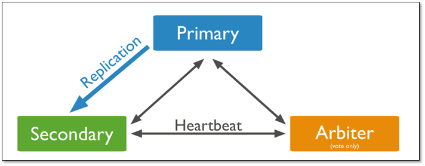 

说明：

> 　　由于arbiter节点没有复制数据，因此这个架构中仅提供一个完整的数据副本。arbiter节点只需要更少的资源，代价是更有限的冗余和容错。

   当主库宕机时，将会选择从库成为主，主库修复后，将其加入到现有的复制集群中即可。

​                                                                     

### 1.2.3 Primary 选举

　　复制集通过 replSetInitiate 命令（或mongo shell的rs.initiate()）进行初始化，初始化后各个成员间开始发送心跳消息，并发起 Priamry 选举操作，获得『大多数』成员投票支持的节点，会成为Primary，其余节点成为Secondary。

**『大多数』的定义**

　　假设复制集内投票成员（后续介绍）数量为N，则大多数为 N/2 + 1，当复制集内存活成员数量不足大多数时，整个复制集将无法选举出Primary，复制集将无法提供写服务，处于只读状态。

| **投票成员数** | **大多数** | **容忍失效数** |
| -------------- | ---------- | -------------- |
| **1**          | 1          | 0              |
| **2**          | 2          | 0              |
| **3**          | 2          | 1              |
| **4**          | 3          | 1              |
| **5**          | 3          | 2              |
| **6**          | 4          | 2              |
| **7**          | 4          | 3              |

　　通常建议将复制集成员数量设置为奇数，从上表可以看出3个节点和4个节点的复制集都只能容忍1个节点失效，从『服务可用性』的角度看，其效果是一样的。（但无疑4个节点能提供更可靠的数据存储）

## 1.3 复制集中成员说明

### 1.3.1 所有成员说明 

| **成员**      | **说明**                                                     |
| ------------- | ------------------------------------------------------------ |
| **Secondary** | 正常情况下，复制集的Seconary会参与Primary选举（自身也可能会被选为Primary），并从Primary同步最新写入的数据，以保证与Primary存储相同的数据。Secondary可以提供读服务，增加Secondary节点可以提供复制集的读服务能力，同时提升复制集的可用性。另外，Mongodb支持对复制集的Secondary节点进行灵活的配置，以适应多种场景的需求。 |
| **Arbiter**   | Arbiter节点只参与投票，不能被选为Primary，并且不从Primary同步数据。比如你部署了一个2个节点的复制集，1个Primary，1个Secondary，任意节点宕机，复制集将不能提供服务了（无法选出Primary），这时可以给复制集添加一个Arbiter节点，即使有节点宕机，仍能选出Primary。Arbiter本身不存储数据，是非常轻量级的服务，当复制集成员为偶数时，最好加入一个Arbiter节点，以提升复制集可用性。 |
| **Priority0** | Priority0节点的选举优先级为0，不会被选举为Primary比如你跨机房A、B部署了一个复制集，并且想指定Primary必须在A机房，这时可以将B机房的复制集成员Priority设置为0，这样Primary就一定会是A机房的成员。（注意：如果这样部署，最好将『大多数』节点部署在A机房，否则网络分区时可能无法选出Primary） |
| **Vote0**     | Mongodb 3.0里，复制集成员最多50个，参与Primary选举投票的成员最多7个，其他成员（Vote0）的vote属性必须设置为0，即不参与投票。 |
| **Hidden**    | Hidden节点不能被选为主（Priority为0），并且对Driver不可见。因Hidden节点不会接受Driver的请求，可使用Hidden节点做一些数据备份、离线计算的任务，不会影响复制集的服务。 |
| **Delayed**   | Delayed节点必须是Hidden节点，并且其数据落后与Primary一段时间（可配置，比如1个小时）。因Delayed节点的数据比Primary落后一段时间，当错误或者无效的数据写入Primary时，可通过Delayed节点的数据来恢复到之前的时间点。 |

### 1.3.2 Priority 0节点

　　作为一个辅助可以作为一个备用。在一些复制集中，可能无法在合理的时间内添加新成员的时候。备用成员保持数据的当前最新数据能够替换不可用的成员。

​                                                                      

### 1.3.3 Hidden 节点（隐藏节点）

　　客户端将不会把读请求分发到隐藏节点上，即使我们设定了 复制集读选项 。

　　这些隐藏节点将不会收到来自应用程序的请求。我们可以将隐藏节点专用于报表节点或是备份节点。 延时节点也应该是一个隐藏节点。

​                                                                  

### 1.3.4 Delayed 节点（延时节点）

　　延时节点的数据集是延时的，因此它可以帮助我们在人为误操作或是其他意外情况下恢复数据。

　　举个例子，当应用升级失败，或是误操作删除了表和数据库时，我们可以通过延时节点进行数据恢复。

​                                                                  

## 1.4 配置 MongoDB 复制集

### 1.4.1 环境说明

*系统环境说明：*

```
[root@MongoDB ~]# cat /etc/redhat-release 
CentOS release 6.9 (Final)
[root@MongoDB ~]# uname -r
2.6.32-696.el6.x86_64
[root@MongoDB ~]# /etc/init.d/iptables status
iptables: Firewall is not running.
[root@MongoDB ~]# getenforce 
Disabled
[root@MongoDB ~]# hostname -I
10.0.0.152 172.16.1.152
```

**软件版本说明**

```
　　本次使用的mongodb版本为：mongodb-linux-x86_64-3.2.8.tgz
```

### 1.4.2 前期准备，在root用户下操作

　　本次复制集复制采用Mongodb多实例进行

　　所有的操作都基于安装完成的mongodb服务，详情参照：<http://www.cnblogs.com/eden/p/8214194.html#_label3>[
](http://blog.nmtui.com/)

```
#创建mongod用户
    useradd -u800 mongod
    echo 123456|passwd --stdin mongod 
# 安装mongodb
    mkdir -p /mongodb/bin
 　　cd  /mongodb
　　 wget http://downloads.mongodb.org/linux/mongodb-linux-x86_64-rhel62-3.2.8.tgz
    tar xf  mongodb-linux-x86_64-3.2.8.tgz
    cd mongodb-linux-x86_64-3.2.8/bin/ &&\
    cp * /mongodb/bin
    chown -R mongod.mongod /mongodb
# 切换到mongod用户进行后续操作
    su - mongod
```

### 1.4.3 创建所需目录

```
for  i in 28017 28018 28019 28020
    do 
      mkdir -p /mongodb/$i/conf  
      mkdir -p /mongodb/$i/data  
      mkdir -p /mongodb/$i/log
done 
```

### 1.4.4 配置多实例环境

编辑第一个实例配置文件

```
cat >>/mongodb/28017/conf/mongod.conf<<'EOF'
systemLog:
  destination: file
  path: /mongodb/28017/log/mongodb.log
  logAppend: true
storage:
  journal:
    enabled: true
  dbPath: /mongodb/28017/data
  directoryPerDB: true
  #engine: wiredTiger
  wiredTiger:
    engineConfig:
      # cacheSizeGB: 1
      directoryForIndexes: true
    collectionConfig:
      blockCompressor: zlib
    indexConfig:
      prefixCompression: true
processManagement:
  fork: true
net:
  port: 28017
replication:
  oplogSizeMB: 2048
  replSetName: my_repl
EOF
```

复制配置文件

```
for i in 28018 28019 28020
  do  
   \cp  /mongodb/28017/conf/mongod.conf  /mongodb/$i/conf/
done
```

修改配置文件

```
for i in 28018 28019 28020
  do 
    sed  -i  "s#28017#$i#g" /mongodb/$i/conf/mongod.conf
done
```

启动服务

```
for i in 28017 28018 28019 28020
  do  
    mongod -f /mongodb/$i/conf/mongod.conf 
done
```

\# 关闭服务的方法

```
for i in 28017 28018 28019 28020
   do  
     mongod --shutdown  -f /mongodb/$i/conf/mongod.conf 
done
```

### 1.4.5 配置复制集

登陆数据库，配置mongodb复制

```
shell> mongo --port 28017

config = {_id: 'my_repl', members: [
                          {_id: 0, host: '10.0.0.152:28017'},
                          {_id: 1, host: '10.0.0.152:28018'},
                          {_id: 2, host: '10.0.0.152:28019'}]
          }
```

初始化这个配置

```
> rs.initiate(config)
```

　　   **到此复制集配置完成**

### 1.4.6 测试主从复制

在主节点插入数据

```
my_repl:PRIMARY> db.movies.insert([ { "title" : "Jaws", "year" : 1975, "imdb_rating" : 8.1 },
   { "title" : "Batman", "year" : 1989, "imdb_rating" : 7.6 },
  ] );
```

在主节点查看数据

```
my_repl:PRIMARY> db.movies.find().pretty()
{
    "_id" : ObjectId("5a4d9ec184b9b2076686b0ac"),
    "title" : "Jaws",
    "year" : 1975,
    "imdb_rating" : 8.1
}
{
    "_id" : ObjectId("5a4d9ec184b9b2076686b0ad"),
    "title" : "Batman",
    "year" : 1989,
    "imdb_rating" : 7.6
}
```

　　注：在mongodb复制集当中，默认从库不允许读写。

在从库打开配置（危险）

   　　　**注意：严禁在从库做任何修改操作**

```
my_repl:SECONDARY> rs.slaveOk()
my_repl:SECONDARY> show tables;
movies
my_repl:SECONDARY> db.movies.find().pretty()
{
    "_id" : ObjectId("5a4d9ec184b9b2076686b0ac"),
    "title" : "Jaws",
    "year" : 1975,
    "imdb_rating" : 8.1
}
{
    "_id" : ObjectId("5a4d9ec184b9b2076686b0ad"),
    "title" : "Batman",
    "year" : 1989,
    "imdb_rating" : 7.6
}
```

　　在从库查看完成在登陆到主库

### 1.4.7 复制集管理操作

（1）查看复制集状态：

```
rs.status();     # 查看整体复制集状态
rs.isMaster();   #  查看当前是否是主节点
```

（2）添加删除节点

```
rs.add("ip:port");     #  新增从节点
rs.addArb("ip:port"); #  新增仲裁节点
rs.remove("ip:port"); #  删除一个节点
```

注：

> 添加特殊节点时，
>
> 　　1>可以在搭建过程中设置特殊节点
>
> 　　2>可以通过修改配置的方式将普通从节点设置为特殊节点
>
> 　　/*找到需要改为延迟性同步的数组号*/;

**（3****）配置延时节点（一般延时节点也配置成hidden****）**

```
cfg=rs.conf() 
cfg.members[2].priority=0
cfg.members[2].slaveDelay=120
cfg.members[2].hidden=true
```

　　   注：这里的2是rs.conf()显示的顺序（*除主库之外*），非ID

重写复制集配置

```
rs.reconfig(cfg)   
```

   也可将延时节点配置为arbiter节点

```
cfg.members[2].arbiterOnly=true
```

配置成功后，通过以下命令查询配置后的属性

```
rs.conf();
```

### 1.4.8 副本集其他操作命令

查看副本集的配置信息

```
my_repl:PRIMARY> rs.config()
```

查看副本集各成员的状态

```
my_repl:PRIMARY> rs.status()
```

#### **1.4.8.1**  **副本集角色切换（不要人为随便操作）**

```
rs.stepDown()
rs.freeze(300)  # 锁定从，使其不会转变成主库，freeze()和stepDown单位都是秒。
rs.slaveOk()    # 设置副本节点可读：在副本节点执行
```

   插入数据

```
> use app
switched to db app
app> db.createCollection('a')
{ "ok" : 0, "errmsg" : "not master", "code" : 10107 }
```

查看副本节点

```
> rs.printSlaveReplicationInfo()
source: 192.168.1.22:27017
    syncedTo: Thu May 26 2016 10:28:56 GMT+0800 (CST)
    0 secs (0 hrs) behind the primary
```

# 三、MongoDB分片(Sharding)技术

　　分片（sharding）是MongoDB用来将大型集合分割到不同服务器（或者说一个集群）上所采用的方法。尽管分片起源于关系型数据库分区，但MongoDB分片完全又是另一回事。

　　和MySQL分区方案相比，MongoDB的最大区别在于它几乎能自动完成所有事情，只要告诉MongoDB要分配数据，它就能自动维护数据在不同服务器之间的均衡。

## 2.1 MongoDB分片介绍

### 2.1.1 分片的目的

　　高数据量和吞吐量的数据库应用会对单机的性能造成较大压力,大的查询量会将单机的CPU耗尽,大的数据量对单机的存储压力较大,最终会耗尽系统的内存而将压力转移到磁盘IO上。

　　为了解决这些问题,有两个基本的方法: 垂直扩展和水平扩展。

　　　　垂直扩展：增加更多的CPU和存储资源来扩展容量。

　　　　水平扩展：将数据集分布在多个服务器上。水平扩展即分片。

### 2.1.2 分片设计思想

　　分片为应对高吞吐量与大数据量提供了方法。使用分片减少了每个分片需要处理的请求数，因此，通过水平扩展，集群可以提高自己的存储容量和吞吐量。举例来说，当插入一条数据时，应用只需要访问存储这条数据的分片.

　　使用分片减少了每个分片存储的数据。

　　例如，如果数据库1tb的数据集，并有4个分片，然后每个分片可能仅持有256 GB的数据。如果有40个分片，那么每个切分可能只有25GB的数据。

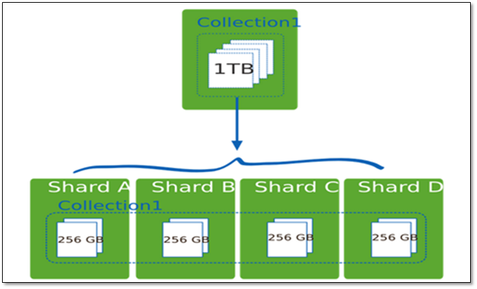

### 2.1.3 分片机制提供了如下三种优势

**1.对集群进行抽象，让集群“不可见”**

　　MongoDB自带了一个叫做mongos的专有路由进程。mongos就是掌握统一路口的路由器，其会将客户端发来的请求准确无误的路由到集群中的一个或者一组服务器上，同时会把接收到的响应拼装起来发回到客户端。

**2.保证集群总是可读写**

　　MongoDB通过多种途径来确保集群的可用性和可靠性。将MongoDB的分片和复制功能结合使用，在确保数据分片到多台服务器的同时，也确保了每分数据都有相应的备份，这样就可以确保有服务器换掉时，其他的从库可以立即接替坏掉的部分继续工作。

**3.使集群易于扩展**

　　当系统需要更多的空间和资源的时候，MongoDB使我们可以按需方便的扩充系统容量。

### 2.1.4 分片集群架构

| **组件**          | **说明**                                                     |
| ----------------- | ------------------------------------------------------------ |
| **Config Server** | 存储集群所有节点、分片数据路由信息。默认需要配置3个Config Server节点。 |
| **Mongos**        | 提供对外应用访问，所有操作均通过mongos执行。一般有多个mongos节点。数据迁移和数据自动平衡。 |
| **Mongod**        | 存储应用数据记录。一般有多个Mongod节点，达到数据分片目的。   |

​                                                              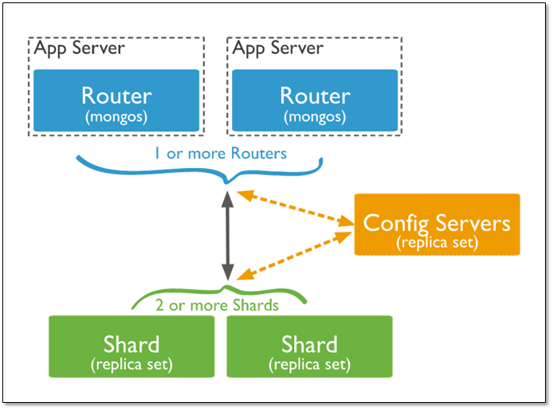

**分片集群的构造**

>  （1）mongos ：数据路由，和客户端打交道的模块。mongos本身没有任何数据，他也不知道该怎么处理这数据，去找config server
>
> （2）config server：所有存、取数据的方式，所有shard节点的信息，分片功能的一些配置信息。可以理解为真实数据的元数据。
>
>  （3）shard：真正的数据存储位置，以chunk（块）为单位存数据。

　　Mongos本身并不持久化数据，Sharded cluster所有的元数据都会存储到Config Server，而用户的数据会议分散存储到各个shard。Mongos启动后，会从配置服务器加载元数据，开始提供服务，将用户的请求正确路由到对应的碎片。

**Mongos的路由功能**

　　当数据写入时，MongoDB Cluster根据分片键设计写入数据。

　　当外部语句发起数据查询时，MongoDB根据数据分布自动路由至指定节点返回数据。

## 2.2 集群中数据分布

### 2.2.1 Chunk是什么

　　在一个shard server内部，MongoDB还是会把数据分为chunks，每个chunk代表这个shard server内部一部分数据。chunk的产生，会有以下两个用途：

　　**Splitting**：当一个chunk的大小超过配置中的chunk size时，MongoDB的后台进程会把这个chunk切分成更小的chunk，从而避免chunk过大的情况

　　**Balancing**：在MongoDB中，balancer （均衡器）是一个后台进程，负责chunk的迁移，从而均衡各个shard server的负载，系统初始1个chunk，chunk size默认值64M,生产库上选择适合业务的chunk size是最好的。MongoDB会自动拆分和迁移chunks。

**分片集群的数据分布（shard节点）**

> （1）使用chunk来存储数据
>
> （2）进群搭建完成之后，默认开启一个chunk，大小是64M，
>
> （3）存储需求超过64M，chunk会进行分裂，如果单位时间存储需求很大，设置更大的chunk
>
> （4）chunk会被自动均衡迁移。

### 2.2.2 chunksize的选择

　　适合业务的chunksize是最好的。

　　chunk的分裂和迁移非常消耗IO资源；chunk分裂的时机：在插入和更新，读数据不会分裂。

　　**chunksize的选择：**

　　小的chunksize：数据均衡是迁移速度快，数据分布更均匀。数据分裂频繁，路由节点消耗更多资源。大的chunksize：数据分裂少。数据块移动集中消耗IO资源。通常100-200M

### 2.2.3 chunk分裂及迁移

　　随着数据的增长，其中的数据大小超过了配置的chunk size，默认是64M，则这个chunk就会分裂成两个。数据的增长会让chunk分裂得越来越多。

​                                                                                                   

　　这时候，各个shard 上的chunk数量就会不平衡。这时候，mongos中的一个组件 balancer  就会执行自动平衡。把chunk从chunk数量最多的shard节点挪动到数量最少的节点。

​                                                                     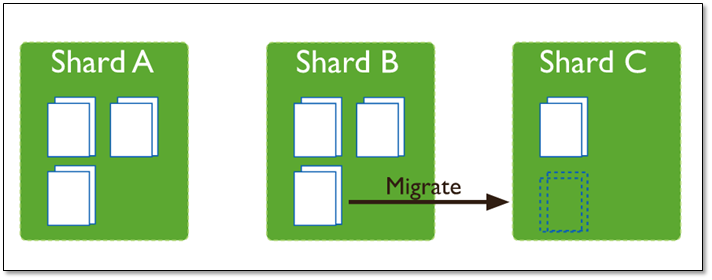 

**chunkSize** **对分裂及迁移的影响**

　　MongoDB 默认的 chunkSize 为64MB，如无特殊需求，建议保持默认值；chunkSize 会直接影响到 chunk 分裂、迁移的行为。

　　chunkSize 越小，chunk 分裂及迁移越多，数据分布越均衡；反之，chunkSize 越大，chunk 分裂及迁移会更少，但可能导致数据分布不均。

　　chunkSize 太小，容易出现 jumbo chunk（即shardKey 的某个取值出现频率很高，这些文档只能放到一个 chunk 里，无法再分裂）而无法迁移；chunkSize 越大，则可能出现 chunk 内文档数太多（chunk 内文档数不能超过 250000 ）而无法迁移。

　　chunk 自动分裂只会在数据写入时触发，所以如果将 chunkSize 改小，系统需要一定的时间来将 chunk 分裂到指定的大小。

　　chunk 只会分裂，不会合并，所以即使将 chunkSize 改大，现有的 chunk 数量不会减少，但 chunk 大小会随着写入不断增长，直到达到目标大小。

## 2.3 数据区分

### 2.3.1 分片键 shard key

　　MongoDB中数据的分片是、以集合为基本单位的，集合中的数据通过片键（Shard key）被分成多部分。其实片键就是在**集合中选一个键**，用**该键的值作为数据拆分的依据。**

　　所以一个好的片键对分片至关重要。**片键必须是一个索引**，通过sh.shardCollection加会**自动创建索引**（前提是此集合不存在的情况下）。一个自增的片键对写入和数据均匀分布就不是很好，因为自增的片键总会在一个分片上写入，后续达到某个阀值可能会写到别的分片。但是按照片键查询会非常高效。

　　随机片键对数据的均匀分布效果很好。注意尽量避免在多个分片上进行查询。在所有分片上查询，mongos会对结果进行归并排序。

　　对集合进行分片时，你需要选择一个片键，**片键是每条记录都必须包含的**，且**建立了索引的单个字段或复合字段**，MongoDB**按照片键将数据划分到不同的数据块中**，并将**数据块均衡地分布到所有分片**中。

　　为了按照片键划分数据块，MongoDB使用基于范围的分片方式或者 基于哈希的分片方式。

**注意：**

> 分片键是不可变。
>
> 分片键必须有索引。
>
> 分片键大小限制512bytes。
>
> 分片键用于路由查询。
>
> MongoDB不接受已进行 collection 级分片的 collection 上插入无分片键的文档
>
> 键的文档（也不支持空值插入）

### 2.3.2 以范围为基础的分片Sharded Cluster

　　Sharded Cluster支持将单个集合的数据分散存储在多shard上，用户可以指定根据集合内文档的某个字段即shard key来进行范围分片（range sharding）。

​                                                                  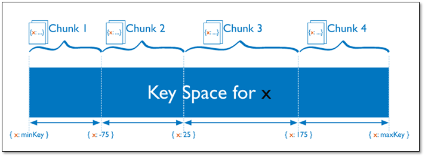

　　对于基于范围的分片，MongoDB按照片键的范围把数据分成不同部分。

　　假设有一个数字的片键: 想象一个从负无穷到正无穷的直线，每一个片键的值都在直线上画了一个点。MongoDB把这条直线划分为更短的不重叠的片段，并称之为数据块，每个数据块包含了片键在一定范围内的数据。在使用片键做范围划分的系统中，拥有”相近”片键的文档很可能存储在同一个数据块中，因此也会存储在同一个分片中。

### 2.3.3 基于哈希的分片

　　分片过程中利用哈希索引作为分片的单个键，且哈希分片的片键只能使用一个字段，而基于哈希片键最大的好处就是保证数据在各个节点分布基本均匀。

​                                                                      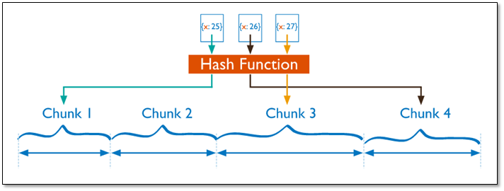

　　对于基于哈希的分片，MongoDB计算一个字段的哈希值，并用这个哈希值来创建数据块。在使用基于哈希分片的系统中，拥有”相近”片键的文档很可能不会存储在同一个数据块中，因此数据的分离性更好一些。

　　Hash分片与范围分片互补，能将文档随机的分散到各个chunk，充分的扩展写能力，弥补了范围分片的不足，但不能高效的服务范围查询，所有的范围查询要分发到后端所有的Shard才能找出满足条件的文档。

### 2.3.4 分片键选择建议

**1、递增的 sharding key**

> 数据文件挪动小。（优势）
>
> 因为数据文件递增，所以会把insert的写IO永久放在最后一片上，造成最后一片的写热点。同时，随着最后一片的数据量增大，将不断的发生迁移至之前的片上。

**2、随机的 sharding key**

> 数据分布均匀，insert的写IO均匀分布在多个片上。（优势）
>
> 大量的随机IO，磁盘不堪重荷。

**3、混合型 key**

> 大方向随机递增，小范围随机分布。
>
> 为了防止出现大量的chunk均衡迁移，可能造成的IO压力。我们需要设置合理分片使用策略（片键的选择、分片算法（range、hash））

**分片注意：**

   分片键是不可变、分片键必须有索引、分片键大小限制512bytes、分片键用于路由查询。

   MongoDB不接受已进行collection级分片的collection上插入无分片键的文档（也不支持空值插入）

## 2.4 部署分片集群

　　本集群的部署基于1.1的复制集搭建完成。

### 2.4.1 环境准备

创建程序所需的目录

```
for  i in 17 18 19 20 21 22 23 24 25 26 
  do 
  mkdir -p /mongodb/280$i/conf  
  mkdir -p /mongodb/280$i/data  
  mkdir -p /mongodb/280$i/log
done
```

### 2.4.2 shard集群配置

编辑shard集群配置文件

```
cat > /mongodb/28021/conf/mongod.conf <<'EOF'
systemLog:
  destination: file
  path: /mongodb/28021/log/mongodb.log   
  logAppend: true
storage:
  journal:
    enabled: true
  dbPath: /mongodb/28021/data
  directoryPerDB: true
  #engine: wiredTiger
  wiredTiger:
    engineConfig:
      cacheSizeGB: 1
      directoryForIndexes: true
    collectionConfig:
      blockCompressor: zlib
    indexConfig:
      prefixCompression: true
net:
  bindIp: 10.0.0.152
  port: 28021
replication:
  oplogSizeMB: 2048
  replSetName: sh1
sharding:
  clusterRole: shardsvr
processManagement: 
  fork: true
EOF
```

复制shard集群配置文件

```
for  i in  22 23 24 25 26  
  do  
   \cp  /mongodb/28021/conf/mongod.conf  /mongodb/280$i/conf/
done
```

修改配置文件端口

```
for  i in   22 23 24 25 26  
  do 
    sed  -i  "s#28021#280$i#g" /mongodb/280$i/conf/mongod.conf
done
```

   修改配置文件复制集名称（replSetName）

```
for  i in    24 25 26  
  do 
    sed  -i  "s#sh1#sh2#g" /mongodb/280$i/conf/mongod.conf
done
```

启动shard集群

```
for  i in  21 22 23 24 25 26
  do  
    mongod -f /mongodb/280$i/conf/mongod.conf 
done
```

配置复制集1

```
mongo --host 10.0.0.152 --port 28021  admin
```


```
config = {_id: 'sh1', members: [
                          {_id: 0, host: '10.0.0.152:28021'},
                          {_id: 1, host: '10.0.0.152:28022'},
                          {_id: 2, host: '10.0.0.152:28023',"arbiterOnly":true}]
           }  
 # 初始化配置
rs.initiate(config)  
```

 配置复制集2

```
mongo --host 10.0.0.152 --port 28024  admin
```


```
config = {_id: 'sh2', members: [
                          {_id: 0, host: '10.0.0.152:28024'},
                          {_id: 1, host: '10.0.0.152:28025'},
                          {_id: 2, host: '10.0.0.152:28026',"arbiterOnly":true}]
           }
# 初始化配置
rs.initiate(config)
```

### 2.4.3 config 集群配置

创建主节点配置文件

```
cat > /mongodb/28018/conf/mongod.conf <<'EOF'
systemLog:
  destination: file
  path: /mongodb/28018/log/mongodb.conf
  logAppend: true
storage:
  journal:
    enabled: true
  dbPath: /mongodb/28018/data
  directoryPerDB: true
  #engine: wiredTiger
  wiredTiger:
    engineConfig:
      cacheSizeGB: 1
      directoryForIndexes: true
    collectionConfig:
      blockCompressor: zlib
    indexConfig:
      prefixCompression: true
net:
  bindIp: 10.0.0.152
  port: 28018
replication:
  oplogSizeMB: 2048
  replSetName: configReplSet
sharding:
  clusterRole: configsvr
processManagement: 
  fork: true
EOF
```

将配置文件分发到从节点

```
for  i in 19 20 
  do  
   \cp  /mongodb/28018/conf/mongod.conf  /mongodb/280$i/conf/
done
```

修改配置文件端口信息

```
for  i in 19 20  
  do 
    sed  -i  "s#28018#280$i#g" /mongodb/280$i/conf/mongod.conf
done
```

启动config server集群

```
for  i in  18 19 20 
  do  
    mongod -f /mongodb/280$i/conf/mongod.conf 
done
```

配置config server复制集

```
mongo --host 10.0.0.152 --port 28018  admin
```

\# 配置复制集信息

```
config = {_id: 'configReplSet', members: [
                          {_id: 0, host: '10.0.0.152:28018'},
                          {_id: 1, host: '10.0.0.152:28019'},
                          {_id: 2, host: '10.0.0.152:28020'}]
           }
# 初始化配置
rs.initiate(config)    
```

　　注：config server 使用复制集不用有arbiter节点。3.4版本以后config必须为复制集

### 2.4.4 mongos节点配置

修改配置文件

```
cat > /mongodb/28017/conf/mongos.conf <<'EOF'
systemLog:
  destination: file
  path: /mongodb/28017/log/mongos.log
  logAppend: true
net:
  bindIp: 10.0.0.152
  port: 28017
sharding:
  configDB: configReplSet/10.0.0.152:28108,10.0.0.152:28019,10.0.0.152:28020
processManagement: 
  fork: true
EOF
```

启动mongos

```
mongos -f /mongodb/28017/conf/mongos.conf
```

登陆到mongos

```
mongo 10.0.0.152:28017/admin
```

添加分片节点

```
db.runCommand( { addshard : "sh1/10.0.0.152:28021,10.0.0.152:28022,10.0.0.152:28023",name:"shard1"} )
db.runCommand( { addshard : "sh2/10.0.0.152:28024,10.0.0.152:28025,10.0.0.152:28026",name:"shard2"} )
```

列出分片

```
mongos> db.runCommand( { listshards : 1 } )
{
    "shards" : [
        {
            "_id" : "shard2",
            "host" : "sh2/10.0.0.152:28024,10.0.0.152:28025"
        },
        {
            "_id" : "shard1",
            "host" : "sh1/10.0.0.152:28021,10.0.0.152:28022"
        }
    ],
    "ok" : 1
}
```

整体状态查看

```
mongos> sh.status();
```

   **至此MongoDB的分片集群就搭建完成。**

### 2.4.5 数据库分片配置

激活数据库分片功能

```
语法：( { enablesharding : "数据库名称" } )

mongos> db.runCommand( { enablesharding : "test" } )
```

指定分片建对集合分片，范围片键--创建索引

```
mongos> use test 
mongos> db.vast.ensureIndex( { id: 1 } )
mongos> use admin
mongos> db.runCommand( { shardcollection : "test.vast",key : {id: 1} } )
```

集合分片验证

```
mongos> use test
mongos> for(i=0;i<20000;i++){ db.vast1.insert({"id":i,"name":"eden","age":70,"date":new Date()}); }
mongos> db.vast.stats()
```

　　  插入数据的条数尽量大些，能够看出更好的效果。

## 2.5 分片集群的操作

### 2.5.1 不同分片键的配置

**范围片键**

```
admin> sh.shardCollection("数据库名称.集合名称",key : {分片键: 1}  )
或
admin> db.runCommand( { shardcollection : "数据库名称.集合名称",key : {分片键: 1} } )
```

eg：

```
admin > sh.shardCollection("test.vast",key : {id: 1}  )
或
admin> db.runCommand( { shardcollection : "test.vast",key : {id: 1} } )
```

**哈希片键**

```
admin > sh.shardCollection( "数据库名.集合名", { 片键: "hashed" } )
```

**创建哈希索引**

```
admin> db.vast.ensureIndex( { a: "hashed" } )
admin > sh.shardCollection( "test.vast", { a: "hashed" } )
```

### 2.5.2 分片集群的操作

判断是否Shard集群

```
admin> db.runCommand({ isdbgrid : 1})
```

列出所有分片信息

```
admin> db.runCommand({ listshards : 1})
```

列出开启分片的数据库

```
admin> use config
config> db.databases.find( { "partitioned": true } )
config> db.databases.find() //列出所有数据库分片情况
```

查看分片的片键

```
config> db.collections.find()
{
    "_id" : "test.vast",
    "lastmodEpoch" : ObjectId("58a599f19c898bbfb818b63c"),
    "lastmod" : ISODate("1970-02-19T17:02:47.296Z"),
    "dropped" : false,
    "key" : {
        "id" : 1
    },
    "unique" : false
}
```

查看分片的详细信息

```
admin> db.printShardingStatus()
或
admin> sh.status()
```

删除分片节点

```
sh.getBalancerState()
mongos> db.runCommand( { removeShard: "shard2" } )
```

## 2.6 balance 操作

　　查看mongo集群是否开启了 balance 状态

```
mongos> sh.getBalancerState()
true
```

　　当然你也可以通过在路由节点mongos上执行sh.status() 查看balance状态。

　　如果balance开启，查看是否正在有数据的迁移

连接mongo集群的路由节点

```
mongos> sh.isBalancerRunning()
false
```

### 2.6.1 设置balance 窗口

（1）连接mongo集群的路由节点

（2）切换到配置节点

```
     use config
```

（3）确定balance 开启中

```
     sh.getBalancerState()
```

   如果未开启，执行命令

```
   sh.setBalancerState( true )
```

（4）修改balance 窗口的时间

```
db.settings.update(
   { _id: "balancer" },
   { $set: { activeWindow : { start : "<start-time>", stop : "<stop-time>" } } },
   { upsert: true }
)
```

eg：

```
db.settings.update({ _id : "balancer" }, { $set : { activeWindow : { start : "00:00", stop : "5:00" } } }, true )
```

　　当你设置了activeWindow，就不能用sh.startBalancer() 启动balance

> NOTE
>
> The balancer window must be sufficient to complete the migration of all data inserted during the day.
>
> As data insert rates can change based on activity and usage patterns, it is important to ensure that the balancing window you select will be sufficient to support the needs of your deployment.

（5）删除balance 窗口

```
use config
db.settings.update({ _id : "balancer" }, { $unset : { activeWindow : true } })
```

### 2.6.2 关闭balance

　　默认balance 的运行可以在任何时间，只迁移需要迁移的chunk，如果要关闭balance运行，停止一段时间可以用下列方法：

（1） 连接到路由mongos节点

（2） 停止balance

```
      sh.stopBalancer()
```

（3） 查看balance状态

```
  sh.getBalancerState()
```

（4）停止balance 后，没有迁移进程正在迁移，可以执行下列命令

```
use config
while( sh.isBalancerRunning() ) {
          print("waiting...");
          sleep(1000);
}
```

### 2.6.3 重新打开balance

如果你关闭了balance，准备重新打开balance

（1） 连接到路由mongos节点

（2） 打开balance

```
        sh.setBalancerState(true)
```

如果驱动没有命令  sh.startBalancer()，可以用下列命令

```
use config
db.settings.update( { _id: "balancer" }, { $set : { stopped: false } } , { upsert: true } )
```

### 2.6.4 关于集合的balance

关闭某个集合的balance

```
sh.disableBalancing("students.grades")
```

打开某个集合的balance

```
sh.enableBalancing("students.grades")
```

确定某个集合的balance是开启或者关闭

```
db.getSiblingDB("config").collections.findOne({_id : "students.grades"}).noBalance;
```

### 2.6.5 问题解决

mongodb在做自动分片平衡的时候，或引起数据库响应的缓慢，可以通过禁用自动平衡以及设置自动平衡进行的时间来解决这一问题。

（1）禁用分片的自动平衡

```
// connect to mongos
> use config
> db.settings.update( { _id: "balancer" }, { $set : { stopped: true } } , true );
```

（2）自定义 自动平衡进行的时间段

```
// connect to mongos
> use config
> db.settings.update({ _id : "balancer" }, { $set : { activeWindow : { start : "21:00", stop : "9:00" } } }, true )
```

# 四、MongoDB 的备份与恢复

## 1.1 MongoDB的常用命令

```
mongoexport / mongoimport
mongodump  / mongorestore
```

　　   有以上两组命令在备份与恢复中进行使用。

### 1.1.1 导出工具 mongoexport

Mongodb中的mongoexport工具可以把一个collection导出成JSON格式或CSV格式的文件。可以通过参数指定导出的数据项，也可以根据指定的条件导出数据。

   该命令的参数如下：

| **参数**                     | **参数说明**           |
| ---------------------------- | ---------------------- |
| **-h**                       | 指明数据库宿主机的IP   |
| **-u**                       | 指明数据库的用户名     |
| **-p**                       | 指明数据库的密码       |
| **-d**                       | 指明数据库的名字       |
| **-c**                       | 指明collection的名字   |
| **-f**                       | 指明要导出那些字段     |
| **-o**                       | 指明到要导出的文件名   |
| **-q**                       | 指明导出数据的过滤条件 |
| **--type**                   | 指定文件类型           |
| **--authenticationDatabase** | 验证数据的名称         |

**mongoexport备份实践**

备份app库下的vast集合

```
mongoexport -h 10.0.0.152:27017 -uroot -proot --authenticationDatabase admin -d app -c vast -o /home/mongod/backup/vasts.dat
```

注：备份文件的名字可以自定义，默认导出了JSON格式的数据。

导出CSV格式的数据

```
mongoexport -h 10.0.0.152:27017 -uroot -proot --authenticationDatabase admin  -d app -c vast --type=csv -f id,name -o /home/mongod/backup/vast_csv.dat
```

### 1.1.2 导入工具mongoimport（还原）

　　Mongodb 中的 mongoimport 工具可以把一个特定格式文件中的内容导入到指定的 collection 中。该工具可以导入JSON格式数据，也可以导入CSV格式数据。

该命令的参数如下：   

| **参数**                     | **参数说明**                          |
| ---------------------------- | ------------------------------------- |
| **-h**                       | 指明数据库宿主机的IP                  |
| **-u**                       | 指明数据库的用户名                    |
| **-p**                       | 指明数据库的密码                      |
| **-d**                       | 指明数据库的名字                      |
| **-c**                       | 指明collection的名字                  |
| **-f**                       | 指明要导出那些列                      |
| **-o**                       | 指明到要导出的文件名                  |
| **-q**                       | 指明导出数据的过滤条件                |
| **--drop**                   | 插入之前先删除原有的                  |
| **--headerline**             | 指明第一行是列名，不需要导入。        |
| **-j**                       | 同时运行的插入操作数（默认为1），并行 |
| **--authenticationDatabase** | 验证数据的名称                        |

**mongoimport恢复实践**

将之前恢复的数据导入

```
mongoimport -h 10.0.0.152:27017 -uroot -proot --authenticationDatabase admin  -d app -c vast  --drop /home/mongod/backup/vasts.dat
```

将之前恢复的CSV格式数据导入

```
mongoimport -h 10.0.0.152:27017 -uroot -proot --authenticationDatabase admin -d app -c vast --type=csv --headerline --file vast_csv.dat
```

### 1.1.3 【实验】mysql 数据迁移至 mongodb 数据库

　　　　mysql相关的参考文档：<http://www.cnblogs.com/eden/category/1131345.html>

将mysql数据库中的mysql下的user表导出。

```
select user,host,password from mysql.user
into outfile '/tmp/user.csv'
fields terminated by ','
optionally enclosed by '"'
escaped by '"' 
lines terminated by '\r\n';
```

命令说明：

```
into outfile '/tmp/user.csv'  ------导出文件位置  
fields terminated by ','　　   ------字段间以,号分隔
optionally enclosed by '"'　  ------字段用"号括起
escaped by '"'   　　　　　   　------字段中使用的转义符为"
lines terminated by '\r\n'; 　------行以\r\n结束
```

查看导出内容

```
[mongod@MongoDB tmp]$ cat user.csv 
"root","localhost",""
"root","db02",""
"root","127.0.0.1",""
"root","::1",""
"","localhost",""
"","db02",""
"repl","10.0.0.%","*23AE809DDACAF96AF0FD78ED04B6A265E05AA257"
"mha","10.0.0.%","*F4C9AC49A736981AE2739FC2F4A1FD92B4F07929"
```

在mongodb中导入数据

```
mongoimport -h 10.0.0.152:27017 -uroot -proot --authenticationDatabase admin -d app -c user -f user,host,password  --type=csv --file /tmp/user.csv
```

   查看导入的内容

```
[root@MongoDB tmp]# mongo --port 27017 
MongoDB shell version: 3.2.8
connecting to: 127.0.0.1:27017/test
> use app 
switched to db app
> db.user.find()
{ "_id" : ObjectId("5a53206b3b42ae4683180009"), "user" : "root\tlocalhost" }
{ "_id" : ObjectId("5a53206b3b42ae468318000a"), "user" : "root\tdb02" }
{ "_id" : ObjectId("5a53206b3b42ae468318000b"), "user" : "root\t127.0.0.1" }
{ "_id" : ObjectId("5a53206b3b42ae468318000c"), "user" : "root\t::1" }
{ "_id" : ObjectId("5a53206b3b42ae468318000d"), "user" : "localhost" }
{ "_id" : ObjectId("5a53206b3b42ae468318000e"), "user" : "db02" }
{ "_id" : ObjectId("5a53206b3b42ae468318000f"), "user" : "repl\t10.0.0.%\t*23AE809DDACAF96AF0FD78ED04B6A265E05AA257" }
{ "_id" : ObjectId("5a53206b3b42ae4683180010"), "user" : "mha\t10.0.0.%\t*F4C9AC49A736981AE2739FC2F4A1FD92B4F07929" }
```

　　   到此数据迁移完成。

## 1.2 mongodump/mongorestore实践

### 1.2.1 mongodump备份工具

　　mongodump的参数与mongoexport的参数基本一致 

| **参数**                     | **参数说明**                                  |
| ---------------------------- | --------------------------------------------- |
| **-h**                       | 指明数据库宿主机的IP                          |
| **-u**                       | 指明数据库的用户名                            |
| **-p**                       | 指明数据库的密码                              |
| **-d**                       | 指明数据库的名字                              |
| **-c**                       | 指明collection的名字                          |
| **-o**                       | 指明到要导出的文件名                          |
| **-q**                       | 指明导出数据的过滤条件                        |
| **--authenticationDatabase** | 验证数据的名称                                |
| **--gzip**                   | 备份时压缩                                    |
| **--oplog**                  | use oplog for taking a point-in-time snapshot |

**mongodump 参数实践**

全库备份

```
mongodump -h 10.0.0.152:27017 -uroot -proot --authenticationDatabase admin  -o /home/mongod/backup/full
```

备份test库

```
mongodump -h 10.0.0.152:27017 -uroot -proot --authenticationDatabase admin  -d test -o /home/mongod/backup/
```

备份test库下的vast集合

```
mongodump -h 10.0.0.152:27017 -uroot -proot --authenticationDatabase admin  -d test -c vast -o /home/mongod/backup/
```

压缩备份库

```
mongodump -h 10.0.0.152:27017 -uroot -proot --authenticationDatabase admin  -d test -o /home/mongod/backup/ --gzip
```

压缩备份单集合

```
mongodump -h 10.0.0.152:27017 -uroot -proot --authenticationDatabase admin  -d test -c vast -o /home/mongod/backup/ --gzip
```

### 1.2.2 mongorestore 恢复实践

　　mongorestore与mongoimport参数类似 

| **参数**                     | **参数说明**                                  |
| ---------------------------- | --------------------------------------------- |
| **-h**                       | 指明数据库宿主机的IP                          |
| **-u**                       | 指明数据库的用户名                            |
| **-p**                       | 指明数据库的密码                              |
| **-d**                       | 指明数据库的名字                              |
| **-c**                       | 指明collection的名字                          |
| **-o**                       | 指明到要导出的文件名                          |
| **-q**                       | 指明导出数据的过滤条件                        |
| **--authenticationDatabase** | 验证数据的名称                                |
| **--gzip**                   | 备份时压缩                                    |
| **--oplog**                  | use oplog for taking a point-in-time snapshot |
| **--drop**                   | 恢复的时候把之前的集合drop掉                  |

全库备份中恢复单库（基于之前的全库备份）

```
mongorestore -h 10.0.0.152:27017 -uroot -proot --authenticationDatabase admin -d test --drop  /home/mongod/backup/full/test/
```

恢复test库

```
mongorestore -h 10.0.0.152:27017 -uroot -proot --authenticationDatabase admin -d test /home/mongod/backup/test/
```

恢复test库下的vast集合

```
mongorestore -h 10.0.0.152:27017 -uroot -proot --authenticationDatabase admin -d test -c vast /home/mongod/backup/test/vast.bson
```

--drop参数实践恢复

```
# 恢复单库
mongorestore -h 10.0.0.152:27017 -uroot -proot --authenticationDatabase admin -d test --drop /home/mongod/backup/test/
# 恢复单表
mongorestore -h 10.0.0.152:27017 -uroot -proot --authenticationDatabase admin -d test -c vast --drop /home/mongod/backup/test/vast.bson
```

### 1.2.3 mongoexport/mongoimport与mongodump/mongorestore的对比

>  1. mongoexport/mongoimport导入/导出的是JSON格式，而mongodump/mongorestore导入/导出的是BSON格式。
>2. JSON可读性强但体积较大，BSON则是二进制文件，体积小但对人类几乎没有可读性。
> 3. 在一些mongodb版本之间，BSON格式可能会随版本不同而有所不同，所以不同版本之间用mongodump/mongorestore可能不会成功，具体要看版本之间的兼容性。当无法使用BSON进行跨版本的数据迁移的时候，使用JSON格式即mongoexport/mongoimport是一个可选项。跨版本的mongodump/mongorestore并不推荐，实在要做请先检查文档看两个版本是否兼容（大部分时候是的）。
> 4. JSON虽然具有较好的跨版本通用性，但其只保留了数据部分，不保留索引，账户等其他基础信息。使用时应该注意。

## 1.3 MongoDB中的 oplog

### 1.3.1 什么是oplog

　　MongoDB 的Replication是通过一个日志来存储写操作的，这个日志就叫做 oplog。

　　在默认情况下,oplog分配的是5%的空闲磁盘空间。通常而言,这是一种合理的设置。可以通过mongod --oplogSize来改变oplog的日志大小。

　　**oplog **是 capped collection，因为 oplog 的特点（不能太多把磁盘填满了，固定大小）需要，MongoDB才发明了capped collection（the oplog is actually the reason capped collections were invented）. 定值大小的集合，oplogSizeMB: 2048，oplog是具有幂等性，执行过后的不会反复执行。

　　**值得注意的是，oplog 为replica set或者master/slave模式专用（standalone 模式运行mongodb并不推荐）。**

oplog的位置：

> oplog在local库： local。oplog
>
> master/slave 架构下：local.oplog.$main;
>
>  replica sets 架构下：local.oplog.rs

参数说明

```
$ mongodump --help
 --oplog use oplog for taking a point-in-time snapshot
```

　　该参数的主要作用是在导出的同时生成一个 oplog.bson 文件，存放在你开始进行dump到dump结束之间所有的 oplog。

　　oplog 官方说明<https://docs.mongodb.com/manual/core/replica-set-oplog/>

​                                                                           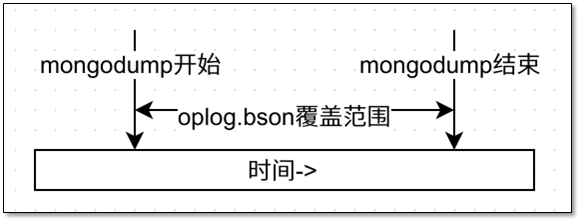

　　简单地说，在replica set中oplog是一个定容集合（capped collection），它的默认大小是磁盘空间的5%（可以通过--oplogSizeMB参数修改），位于local库的db.oplog.rs，有兴趣可以看看里面到底有些什么内容。

　　其中记录的是整个mongod实例一段时间内数据库的所有变更（插入/更新/删除）操作。当空间用完时新记录自动覆盖最老的记录。

　　所以从时间轴上看，oplog的覆盖范围大概是这样的：

​                                                                           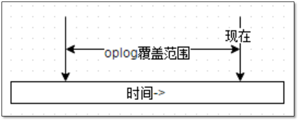 

　　其覆盖范围被称作oplog时间窗口。需要注意的是，因为oplog是一个定容集合，所以时间窗口能覆盖的范围会因为你单位时间内的更新次数不同而变化。想要查看当前的oplog时间窗口预计值.

```
sh1:PRIMARY> rs.printReplicationInfo()
configured oplog size:   2048MB   <--集合大小
log length start to end: 305451secs (84.85hrs)  <--预计窗口覆盖时间
oplog first event time:  Thu Jan 04 2018 19:39:05 GMT+0800 (CST)
oplog last event time:   Mon Jan 08 2018 08:29:56 GMT+0800 (CST)
now:                     Mon Jan 08 2018 16:33:25 GMT+0800 (CST)
```

　　oplog有一个非常重要的特性——**幂等性（idempotent）**。即对一个数据集合，使用oplog中记录的操作重放时，无论被重放多少次，其结果会是一样的。

　　举例来说，如果oplog中记录的是一个插入操作，并**不会因为你重放了两次，数据库中就得到两条相同的记录**。这是一个很重要的特性.

### 1.3.2 oplog.bson作用

与oplog相关的参数

| **参数**          | **参数说明**                                      |
| ----------------- | ------------------------------------------------- |
| **--oplogReplay** | 重放oplog.bson中的操作内容                        |
| **--oplogLimit**  | 与--oplogReplay一起使用时，可以限制重放到的时间点 |

　　首先要明白的一个问题是数据之间互相有依赖性，比如集合A中存放了订单，集合B中存放了订单的所有明细，那么只有一个订单有完整的明细时才是正确的状态。

　　假设在任意一个时间点，A和B集合的数据都是完整对应并且有意义的（对非关系型数据库要做到这点并不容易，且对于MongoDB来说这样的数据结构并非合理。但此处我们假设这个条件成立），那么如果A处于时间点x，而B处于x之后的一个时间点y时，可以想象A和B中的数据极有可能不对应而失去意义。

　　mongodump的进行过程中并不会把数据库锁死以保证整个库冻结在一个固定的时间点，这在业务上常常是不允许的。所以就有了dump的最终结果中A集合是10点整的状态，而B集合则是10点零1分的状态这种情况。

　　这样的备份即使恢复回去，可以想象得到的结果恐怕意义有限。

　　那么上面这个oplog.bson的意义就在这里体现出来了。如果在dump数据的基础上，再重做一遍oplog中记录的所有操作，这时的数据就可以代表dump结束时那个时间点（point-in-time）的数据库状态。

### 1.3.3 【模拟】mongodump使用

首先我们模拟一个不断有插入操作的集合foo，

```
use eden
for(var i = 0; i < 10000; i++) {
    db.eden.insert({a: i});
}
```

　　然后在插入过程中模拟一次mongodump并指定--oplog。

```
mongodump -h 10.0.0.152 --port 28021  --oplog  -o /home/mongod/backup/oplog
```

　　**注意：**--oplog选项只对全库导出有效，所以不能指定-d选项。

　　　　   因为整个实例的变更操作都会集中在local库中的oplog.rs集合中。

根据上面所说，从dump开始的时间系统将记录所有的oplog到oplog.bson中，所以我们得到这些文件：

```
[mongod@MongoDB ~]$ ll /home/mongod/backup/oplog 
total 8
drwxrwxr-x 2 mongod mongod   4096 Jan  8 16:49 admin
drwxrwxr-x 2 mongod mongod   4096 Jan  8 16:49 eden
-rw-rw-r-- 1 mongod mongod  77256 Jan  8 16:49 oplog.bson
```

查看oplog.bson中第一条和最后一条内容

```
[mongod@MongoDB oplog]$ bsondump oplog.bson  >/tmp/oplog.bson.tmp
[mongod@MongoDB oplog]$ head -1 /tmp/oplog.bson.tmp 
{"ts":{"$timestamp":{"t":1515401553,"i":666}},"t":{"$numberLong":"5"},"h":{"$numberLong":"5737315465472464503"},"v":2,"op":"i","ns":"eden.eden1","o":{"_id":{"$oid":"5a533151cc075bd0aa461327"},"a":3153.0}}
[mongod@MongoDB oplog]$ tail -1 /tmp/oplog.bson.tmp 
{"ts":{"$timestamp":{"t":1515401556,"i":34}},"t":{"$numberLong":"5"},"h":{"$numberLong":"-7438621314956315593"},"v":2,"op":"i","ns":"eden.eden1","o":{"_id":{"$oid":"5a533154cc075bd0aa4615de"},"a":3848.0}}
```

　　最终dump出的数据既不是最开始的状态，也不是最后的状态，而是中间某个随机状态。这正是因为集合不断变化造成的。

　　使用mongorestore来恢复

```
[mongod@MongoDB oplog]$ mongorestore -h 10.0.0.152 --port 28021  --oplogReplay  --drop   /home/mongod/backup/oplog
2018-01-08T16:59:18.053+0800    building a list of dbs and collections to restore from /home/mongod/backup/oplog dir
2018-01-08T16:59:18.066+0800    reading metadata for eden.eden from /home/mongod/backup/oplog/eden/eden.metadata.json
2018-01-08T16:59:18.157+0800    restoring eden.eden from /home/mongod/backup/oplog/eden/eden.bson
2018-01-08T16:59:18.178+0800    reading metadata for eden.eden1 from /home/mongod/backup/oplog/eden/eden1.metadata.json
2018-01-08T16:59:18.216+0800    restoring eden.eden1 from /home/mongod/backup/oplog/eden/eden1.bson
2018-01-08T16:59:18.669+0800    restoring indexes for collection eden.eden1 from metadata
2018-01-08T16:59:18.679+0800    finished restoring eden.eden1 (3165 documents)
2018-01-08T16:59:19.850+0800    restoring indexes for collection eden.eden from metadata
2018-01-08T16:59:19.851+0800    finished restoring eden.eden (10000 documents)
2018-01-08T16:59:19.851+0800    replaying oplog
2018-01-08T16:59:19.919+0800    done
```

　　注意黄字体，第一句表示eden.eden1集合中恢复了3165个文档；第二句表示重放了oplog中的所有操作。所以理论上eden1应该有16857个文档（3165个来自eden.bson，剩下的来自oplog.bson）。验证一下：

```
sh1:PRIMARY> db.eden1.count()
3849
```

　　这就是带oplog的mongodump的真正作用。

### 1.3.4 从别处而来的oplog

oplog有两种来源：

> 1、mongodump时加上--oplog选项，自动生成的oplog，这种方式的oplog直接 --oplogReplay 就可以恢复
>
>  2、从别处而来，除了--oplog之外，人为获取的oplog

例如：

```
mongodump  --port 28021 -d local -c oplog.rs
```

　　既然dump出的数据配合oplog就可以把数据库恢复到某个状态，那是不是拥有一份从某个时间点开始备份的dump数据，再加上从dump开始之后的oplog，如果oplog足够长，是不是就可以把数据库恢复到其后的任意状态了？**是的！**

　　事实上replica set正是依赖oplog的重放机制在工作。当secondary第一次加入replica set时做的initial sync就相当于是在做mongodump，此后只需要不断地同步和重放oplog.rs中的数据，就达到了secondary与primary同步的目的。

　　既然oplog一直都在oplog.rs中存在，我们为什么还需要在mongodump时指定--oplog呢？需要的时候从oplog.rs中拿不就完了吗？答案是肯定的，你确实可以只dump数据，不需要oplog。

在需要的时候可以再从oplog.rs中取。但前提是oplog时间窗口必须能够覆盖dump的开始时间。

**及时点恢复场景模拟**

模拟生产环境

```
for(i=0;i<300000;i++){ db.oplog.insert({"id":i,"name":"shenzheng","age":70,"date":new Date()}); }
```

   插入数据的同时备份

```
mongodump -h 10.0.0.152 --port 28021  --oplog  -o /home/mongod/backup/config
```

​    备份完成后进行次错误的操作

```
 db.oplog.remove({});
```

备份oplog.rs文件

```
mongodump -h 10.0.0.152 --port 28021 -d local -c oplog.rs -o  /home/mongod/backup/config/oplog
```

   恢复之前备份的数据

```
mongorestore -h 10.0.0.152 --port 28021--oplogReplay /home/mongod/backup/config
```

   截取oplog，找到发生误删除的时间点

```
bsondump oplog.rs.bson |egrep "\"op\":\"d\"\,\"ns\":\"test\.oplog\"" |head -1 
"t":1515379110,"i":1
```

   复制oplog到备份目录

```
cp  /home/mongod/backup/config/oplog/oplog.rs.bson   /home/mongod/backup/config/oplog.bson
```

   进行恢复，添加之前找到的误删除的点（limt）

```
mongorestore -h 10.0.0.152 --port 28021 --oplogReplay --oplogLimit "1515379110:1"  /home/mongod/backup/config
```

　　   **至此一次恢复就完成了**

### 1.3.5 mongodb的备份准则

只针对replica或master/slave，满足这些准则MongoDB就可以进行point-in-time恢复操作：

>  1. 任意两次数据备份的时间间隔（第一次备份开始到第二次备份结束）不能超过oplog时间窗口覆盖范围。
>2. 在上次数据备份的基础上，在oplog时间窗口没有滑出上次备份结束的时间点前进行完整的oplog备份。请充分考虑oplog备份需要的时间，权衡服务器空间情况确定oplog备份间隔。

实际应用中的注意事项：

>  1. 考虑到oplog时间窗口是个变化值，请关注oplog时间窗口的具体时间。
>2. 在靠近oplog时间窗口滑动出有效时间之前必须要有足够的时间dump出需要的oplog.rs，请预留足够的时间，不要顶满时间窗口再备份。
> 3. 当灾难发生时，第一件事情就是要停止数据库的写入操作，以往oplog滑出时间窗口。特别是像上述这样的remove({})操作，瞬间就会插入大量d记录从而导致oplog迅速滑出时间窗口。

分片集群的备份注意事项

> 1、备份什么？
>
> 　　（1）configserver
>
> 　　（2）每一个shard节点
>
> 2、备份需要注意什么？
>
> 　　（1）元数据和真实数据要有对等性（blancer迁移的问题，会造成config和shard备份不一致）
>
>  ​        （2）不同部分备份结束时间点不一样，恢复出来的数据就是有问题的。

## 1.4 MongoDB 监控

为什么要监控？

> 监控及时获得应用的运行状态信息，在问题出现时及时发现。

监控什么？

> CPU、内存、磁盘I/O、应用程序（MongoDB）、进程监控（ps -aux）、错误日志监控

### 1.4.1 MongoDB 集群监控方式

```
db.serverStatus()
```

　　查看实例运行状态（内存使用、锁、用户连接等信息）

　　通过比对前后快照进行性能分析

```
"connections"     # 当前连接到本机处于活动状态的连接数
"activeClients"   # 连接到当前实例处于活动状态的客户端数量
"locks"           # 锁相关参数
"opcounters"      # 启动之后的参数
"opcountersRepl"  # 复制想关
"storageEngine"   # 查看数据库的存储引擎
"mem"             # 内存相关
```

状态:

```
db.stats()
```

显示信息说明：

```
  "db" : "test" ,表示当前是针对"test"这个数据库的描述。想要查看其他数据库，可以先运行$ use databasename(e.g  $use admiin).
　"collections" : 3,表示当前数据库有多少个collections.可以通过运行show collections查看当前数据库具体有哪些collection.
　"objects" : 13，表示当前数据库所有collection总共有多少行数据。显示的数据是一个估计值，并不是非常精确。
　"avgObjSize" : 36,表示每行数据是大小，也是估计值，单位是bytes
　"dataSize" : 468,表示当前数据库所有数据的总大小，不是指占有磁盘大小。单位是bytes
　"storageSize" : 13312,表示当前数据库占有磁盘大小，单位是bytes,因为mongodb有预分配空间机制，为了防止当有大量数据插入时对磁盘的压力,因此会事先多分配磁盘空间。
　"numExtents" : 3,似乎没有什么真实意义。我弄明白之后再详细补充说明。
　"indexes" : 1 ,表示system.indexes表数据行数。
　"indexSize" : 8192,表示索引占有磁盘大小。单位是bytes
   "fileSize" : 201326592，表示当前数据库预分配的文件大小，例如test.0,test.1，不包括test.ns。
```

### 1.4.2 mongostat

　　实时数据库状态，读写、加锁、索引命中、缺页中断、读写等待队列等情况。

　　每秒刷新一次状态值，并能提供良好的可读性，通过这些参数可以观察到MongoDB系统整体性能情况。

```
[mongod@MongoDB oplog]$ mongostat -h 10.0.0.152 --port 28017 
insert query update delete getmore command flushes mapped  vsize   res faults qr|qw ar|aw netIn netOut conn set repl                      time
    *0    *0     *0     *0       0     1|0       0        303.0M 13.0M      0   0|0   0|0  143b     8k    1      RTR 2018-01-08T17:28:42+08:00
```

参数说明： 

| **参数**   | **参数说明**                                                 |
| ---------- | ------------------------------------------------------------ |
| **insert** | 每秒插入量                                                   |
| **query**  | 每秒查询量                                                   |
| **update** | 每秒更新量                                                   |
| **delete** | 每秒删除量                                                   |
| **conn**   | 当前连接数                                                   |
| **qr\|qw** | 客户端查询排队长度（读\|写）最好为0，如果有堆积，数据库处理慢。 |
| **ar\|aw** | 活跃客户端数量（读\|写）                                     |
| **time**   | 当前时间                                                     |

**mongotop命令说明：**

```
[mongod@MongoDB oplog]$ mongotop  -h 127.0.0.1:27017
2018-01-08T17:32:56.623+0800    connected to: 127.0.0.1:27017

                                               ns    total    read    write    2018-01-08T17:32:57+08:00
                               admin.system.roles      0ms     0ms      0ms                             
                               admin.system.users      0ms     0ms      0ms                             
                             admin.system.version      0ms     0ms      0ms                             
                                         app.user      0ms     0ms      0ms                             
             automationcore.automation.job.status      0ms     0ms      0ms                             
                 automationcore.config.automation      0ms     0ms      0ms                             
        automationcore.config.automationTemplates      0ms     0ms      0ms                             
automationcore.config.automationTemplates_archive      0ms     0ms      0ms                             
         automationcore.config.automation_archive      0ms     0ms      0ms                             
                 automationstatus.lastAgentStatus      0ms     0ms      0ms      
```

mongotop重要指标

```
ns：数据库命名空间，后者结合了数据库名称和集合。
total：mongod在这个命令空间上花费的总时间。
read：在这个命令空间上mongod执行读操作花费的时间。
write：在这个命名空间上mongod进行写操作花费的时间。
```

### 1.4.3 db级别命令

```
db.currentOp()
```

　　查看数据库当前执行什么操作。

　　用于查看长时间运行进程。

　　通过（执行时长、操作、锁、等待锁时长)等条件过滤。

　　如果发现一个操作太长，把数据库卡死的话，可以用这个命令杀死他：> db.killOp(608605)

```
db.setProfilingLevel()
```

　　设置server级别慢日志

　　打开profiling：

> 0:不保存
>
> 1:保存慢查询日志
>
>  2:保存所有查询日志

　　注意:级别是对应当前的数据库，而阈值是全局的。

> 查看profiling状态
>
> 查看慢查询：system.profile
>
>  关闭profiling

企业工具ops manager官方文档： [https://docs.opsmanager.mongodb.com/v3.6/](https://www.cnblogs.com/eden/p/ https://docs.opsmanager.mongodb.com/v3.6/)

## 1.5 MongoDB集群性能优化方案

### 1.5.1 优化方向

> 硬件（内存、SSD）
>
> 收缩数据
>
> 增加新的机器、新的副本集
>
> 集群分片键选择
>
> chunk大小设置
>
>  预分片（预先分配存储空间）

### 1.5.2 存储引擎方面

　　WiredTiger是3.0以后的默认存储引擎，细粒度的并发控制和数据压缩提供了更高的性能和存储效率。3.0以前默认的MMAPv1也提高了性能。

　　在MongoDB复制集中可以组合多钟存储引擎，各个实例实现不同的应用需求。

### 1.5.3 其他优化建议

> 收缩数据
>
> 预分片
>
> 增加新的机器、新的副本集
>
> 集群分片键选择
>
>  chunk大小设置

## 1.6 附录：Aliyun 备份策略

### 1.6.1 MongoDB云数据库备份/恢复

​                                                            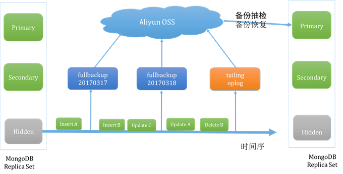 

备份策略：

> 1. 从hidden（隐藏）节点备份
> 2. 每天一次全量备份
> 3. 持续拉取oplog增量备份
> 4. 定期巡检备份有效性
> 5. 恢复时克隆到新实例

### 1.6.2 全量备份方法

​                                                                     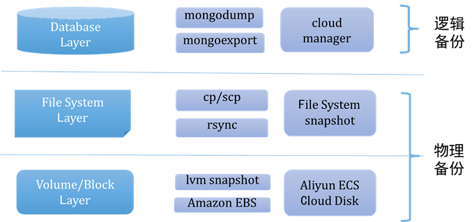

### 1.6.3 逻辑备份流程 - mongodump

​                                                                      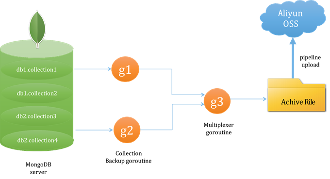

特点：

> 1. 全量遍历所有数据、
> 2. 备份、恢复慢
> 3. 对业务影响较大
> 4. 无需备份索引、恢复时重建
> 5. 通用性强

### 1.6.4 物理备份流程

​                                                                   

备份特点

> 1. 拷贝数据目录所有文件，效率高
> 2. 备份、恢复快
> 3. 对业务影响较小
> 4. 跟数据库版本、配置强关联

### 1.6.5 逻辑备份 vs 物理备份

|            | **逻辑备份**                             | **物理备份**                 |
| ---------- | ---------------------------------------- | ---------------------------- |
| 备份效率   | **低**数据库接口读取数据                 | **高**拷贝物理文件           |
| 恢复效率   | **低**下载备份集 +  导入数据 +  建立索引 | **高**下载备份集 +  启动进程 |
| 备份影响   | **大**直接与业务争抢资源                 | **小**                       |
| 备份集大小 | 比原库小无需备份索引数据                 | 与原库相同                   |
| 兼容性     | 兼容绝大部分版本可跨存储引擎             | 依赖存储布局                 |

