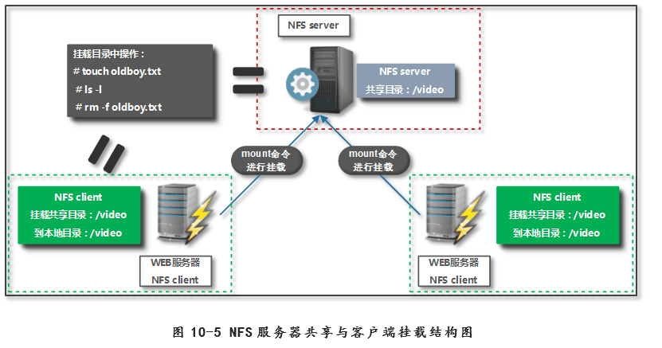
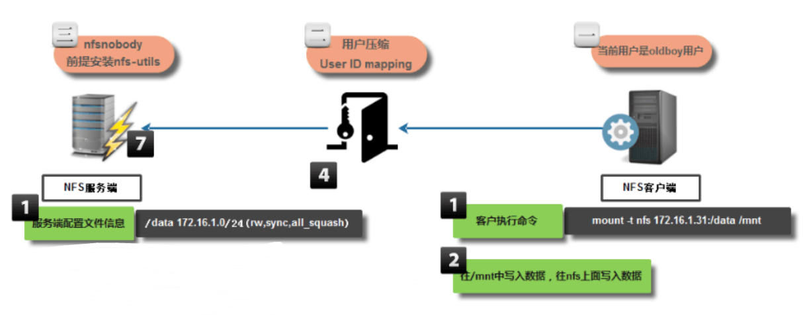
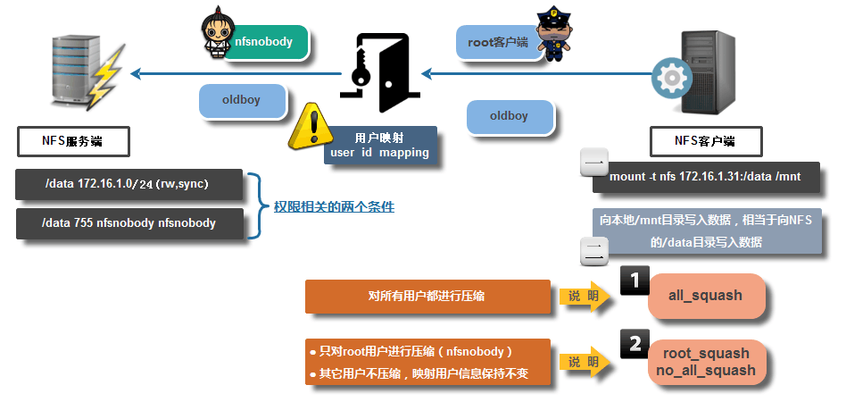

# NFS存储服务部署

# 第1章 NFS介绍

## 1.1 NFS服务内容的概述

> RPC服务知识概念介绍说明，以及RPC服务存在价值
>
> NFS服务工作原理讲解
>
>  NFS共享文件系统使用原理讲解
>
>  NFS服务配罝文件exports编写格式说明

## 1.2 NFS是什么

NFS（Network File System）即**网络文件系统**

   它的主要功能是通过网络（一般是局域网）让不同的主机系统之间可以共享文件或目录。

   分布式文件系统Moosefs(mfs)\glusterFS

### 1.2.1 NFS的qudian

nfs属于本地文件存储服务

>    缺点一：
>
> ​    winndows上无法使用
>
>    缺点二：
>
> 在高并发场景，以及存储量比较高的场景,对数据安全性要求比较高场景
>
> ​        需要采用分布式储存（**mfs  FastDFS**）
>
> ​        分布式文件系统：无法在服务器中看到真实的文件信息

### 1.2.2 实现Windows与linux系统文件数据共享方法

```
        a.ftp(ftp服务部署)        b.samba服务   
```

## 1.3 NFS共享网络文件系统企业应用

> 主要用于存储web服务器上用户上传的数据信息，图片 附件 头像 视频 音频

## 1.4 NFS文件系统存在意义


实现数据共享，数据统一一致

### 1.4.1 实现的不同方法

软件实现：

```
本地文件系统NFS  分布式文件系统 mfs
```

硬件实现：

```
IBM (服务器 小型机 大型机 存储 DS V7000 V5000) oracle EMC = 去IOE
```

## 1.5 NFS 网络文件系统工作方式

> 在nfs服务端创建共享目录
>
> 通过mount 网路挂载，将NFS客户端本地目录挂载到NFS服务端共享目录上
>
>  NFS客户端挂载目录上创建、删除、查看数据操作，等价于在服务端进行的创建、删除、查看数据操作



> 如图10-5所示，在 NFS服务器端设置好一个共享目录 /video后，其他有权限访问 NFS服务器端的客户端都可以将这个共享目录 /video挂载到客户端本地的某个挂载点（其实就是一个目录，这个挂载点目录可以自己随意指定），图10-5中的两个 NFS客户端本地的挂载点分別为/v/video和/video ,不同客户端的挂载点可以不相同。
>
> 客户端正确挂载完毕后，就可以通过 NFS客户端的挂载点所在的/v/video或 /video目录查看
>
> 到 NFS服务器端 /video共享出来的目录下的所有数据。在客户端上查看时 ，NFS服务器端的 /video目录就相当于客户端本地的磁盘分区或目录，几乎感觉不到使用上的区别，根据 NFS服务器端授予 的 NFS共享权限以及共享目录的本地系统权限，只要在指定的 NFS客户端操作挂载/ v/video或/video的目录，就可以将数据轻松地存取到NFS服务器端上的/video目录中了。

## 1.6 NFS网络文件系统重点要了解两个重要服务

```
 RPC服务       NFS服务
```

### 1.6.1 NFS工作流程图

 

 

### 1.6.2 RPC服务工作原理


### 1.6.3 NFS详细的访问流程




**当访问程序通过NFS客户端向NFS服务器存取文件时，其请求数据流程大致如下：**

> 01.首先用户访间网站程序，由程序在NFS客户端上发出存取NFS文件的请求，这时NFS客户端（即执行程序的服务器）的RPC服务（rpcbind服务）就会通过网络向NFS服务器端的RPC服务（rpcbind服务）的111端口发出NFS文件存取功能的询间请求.
> 02.NFS服务器端的RPC服务（rpcbind服务）找到对应的已注册的NFS端口后，通知NFS客户端的RPC服务（rpcbind服务）。
> 03.此时NFS客户端获取到正确的端口,并与NFS daemon联机存取数据
> 04.NFS客户端把数据存取成功后，返回给前端访间程序，告知用户存取结果，作为网站用户，就完成了一次存取操作。

  　　 因为NFS的各项功能都需要向RPC服务（rpcbind服务）注册，所以只有RPC服务才能获取到NFS服务的各项功能对应的端口号（port number)、PID、NFS在主机所监听的IP等信息，而NFS客户端也只能通过向RPC服务询问才能找到正确的端口。也就是说，NFS需要有RPC服务的协助才能成功对外提供服务。从上面的描述，我们不难推断，无论是NFS客户端还是NFS服务器端，当要使用NFS时，都需要首先启动RPC服务，NFS服务必须在RPC服务启动之后启动，客户端无需启动NFS服务，但需要启动RPC服务。

# 第2章 实践操作NFS 服务

## 2.1 进行服务器架构规划

NFS服务器部署角色IP

| **服务器系统**           | **角色**                | **IP**          |
| ------------------------ | ----------------------- | --------------- |
| CentOS release 7 (Final) | NFS服务器端(NFS-Sever)  | 192.168.122.100 |
| CentOS release 7 (Final) | NFS客户端1(NFS-Client1) | 192.168.122.101 |
| CentOS release 7 (Final) | NFS客户端2(NFS-Client2) | 192.168.122.102 |

## 2.2 NFS服务端部署过程

##### 注意（服务端和客户端都要关闭）：

关闭防火墙：

```shell
systemctl disable firewalld
systemctl stop firewalld
```

关闭selinux：

```shell
sed -ri '/^SELINUX=/cSELINUX=Disabled' /etc/selinux/config
setenforce 0
```


### 2.2.1 确认软件是否已经安装，安装NFS服务相关软件

```bash
  rpm -qa|grep nfs
  rpm -qa|grep rpc
```

安装rpcbind nfs-utils服务程序，并进行验证安装是否成功

```bash
  yum install -y nfs-utils rpcbind
```

```
[root@centos701 ~]# rpm -qa nfs-utils rpcbind
rpcbind-0.2.0-48.el7.x86_64
nfs-utils-1.3.0-0.65.el7.x86_64
```


### 2.2.2 编写nfs配置文件

  nfs配置文件默认存在`/etc/exports`

```bash
  vim /etc/exports
  #share /data by clsn for share at 20170220
  /data   192.168.122.0/24(rw,sync) 
```

> /etc/exports文件说明：
>
> 第一部分：/data            --指定共享目录信息
>
> 第二部分：192.168.122.0/24  --指定了一个网段信息，表示允许指定的网段主机挂载到我本地的共享目录上
>
> 第三部分：(rw,sync)       --表示定义共享参数信息，
>
> ​             rw     表示读写，对共享目录设置的权限
>
> ​             sync   同步，数据会先写入到NFS服务器内存中，会立刻同步到磁盘里面==直接存储硬盘中
>
### 2.2.3 创建共享目录，进行权限设定


```shell
mkdir /data -p
chown -R nfsnobody.nfsnobody /data
```

说明：

NFS共享目录管理用户为nfsnobody，此用户不用创建，安装nfs软件时会自动创建

### 2.2.4 启动服务（注意顺序）

   首先，启动rpc服务

```shell
/etc/init.d/rpcbind start
或者
systemctl start rpcbind
```

   其次，启动nfs服务

```shell
/etc/init.d/nfs start
或者
systemctl start nfs
```

  rpcbind服务启动信息查看

```shell
[root@centos701 ~]# ps -ef | grep rpcbind
rpc       1537     1  0 21:59 ?        00:00:00 /sbin/rpcbind -w
root      1625  1281  0 22:01 pts/0    00:00:00 grep --color=auto rpcbind

[root@centos701 ~]# netstat -lnput | grep 111
tcp        0      0 0.0.0.0:111             0.0.0.0:*               LISTEN      1/systemd           
tcp6       0      0 :::111                  :::*                    LISTEN      1/systemd           
udp        0      0 0.0.0.0:111             0.0.0.0:*                           1/systemd           
udp6       0      0 :::111                  :::*                                1/systemd           
```

  nfs启动后查看信息

```shell
[root@centos701 ~]# rpcinfo -p localhost
   program vers proto   port  service
    100000    4   tcp    111  portmapper
    100000    3   tcp    111  portmapper
    100000    2   tcp    111  portmapper
    100000    4   udp    111  portmapper
    100000    3   udp    111  portmapper
    100000    2   udp    111  portmapper
    100024    1   udp  45558  status
    100024    1   tcp  38493  status
    100005    1   udp  20048  mountd
    100005    1   tcp  20048  mountd
    100005    2   udp  20048  mountd
    100005    2   tcp  20048  mountd
    100005    3   udp  20048  mountd
    100005    3   tcp  20048  mountd
    100003    3   tcp   2049  nfs
    100003    4   tcp   2049  nfs
    100227    3   tcp   2049  nfs_acl
    100003    3   udp   2049  nfs
    100003    4   udp   2049  nfs
    100227    3   udp   2049  nfs_acl
    100021    1   udp  43733  nlockmgr
    100021    3   udp  43733  nlockmgr
    100021    4   udp  43733  nlockmgr
    100021    1   tcp  43808  nlockmgr
    100021    3   tcp  43808  nlockmgr
    100021    4   tcp  43808  nlockmgr
```

### 2.2.5 到此服务端部署配置完成

```shell
[root@centos701 ~]# showmount -e 192.168.122.100
Export list for 192.168.122.100:
/data 192.168.122.0/24
```

##### NFS服务开启后，默认的参数文件位置，注意：修改此文件，对nfs服务没有任何影响

```shell
[root@centos701 ~]# cat /var/lib/nfs/etab 
/data	192.168.122.0/24(rw,sync,wdelay,hide,nocrossmnt,secure,root_squash,no_all_squash,no_subtree_check,secure_locks,acl,no_pnfs,anonuid=65534,anongid=65534,sec=sys,rw,secure,root_squash,no_all_squash)
```

## 2.3 NFS 客户端部署

##### 注意（服务端和客户端都要关闭）：

关闭防火墙：

```shell
systemctl disable firewalld
systemctl stop firewalld
```

关闭selinux：

```shell
sed -ri '/^SELINUX=/cSELINUX=Disabled' /etc/selinux/config
setenforce 0
```


### 2.3.1 确认软件有没有安装，进行nfs rpc 服务软件安装部署

```shell
yum install rpcbind nfs-utils -y
```

### 2.3.2 启动服务

**提示：**

rpcbind和nfs软件都可以不启动

### 2.3.3 检查NFS服务端是否有可以进行挂载的目录

```shell
[root@centos702 ~]# rpm -qf $(which showmount)
nfs-utils-1.3.0-0.65.el7.x86_64
```

说明：showmount使用，需要安装nfs-utils软件

### 2.3.4 进程nfs客户端挂载(在客户端上面执行)

```shell
mount -t nfs 192.168.122.100:/data /mnt  # 指将服务端下/data 挂在到本地/mnt下
```

测试  

```shell
[root@centos702 mnt]# showmount -e 192.168.122.100  # 挂载成功
Export list for 192.168.122.100:
/data 192.168.122.0/24

[root@centos702 mnt]# mount -t nfs 192.168.122.100:/data /mnt 
mount.nfs: /mnt is busy or already mounted # 不能再次挂载
```

说明： 如果nfs软件不安装

​        a 无法使用showmount 命令

​        b 客户端无法识别nfs 文件系统类型

### 2.3.5 进行检查测试

```shell
[root@centos702 ~]# df -h
Filesystem               Size  Used Avail Use% Mounted on
devtmpfs                 484M     0  484M   0% /dev
tmpfs                    496M     0  496M   0% /dev/shm
tmpfs                    496M  6.8M  489M   2% /run
tmpfs                    496M     0  496M   0% /sys/fs/cgroup
/dev/mapper/centos-root  8.0G  1.5G  6.6G  19% /
/dev/vda1               1014M  136M  879M  14% /boot
tmpfs                    100M     0  100M   0% /run/user/0
192.168.122.100:/data    8.0G  1.5G  6.6G  19% /mnt   # 重点关注这里
```

**【测试】**本地nfs客户端 进行增删改数据 等价于 nfs服务端共享目录操作

```shell
[root@centos702 mnt]# echo "123" > test.txt
[root@centos702 mnt]# ll test.txt 
-rw-r--r--. 1 nfsnobody nfsnobody 4 Oct 16 22:37 test.txt

[root@centos701 ~]# cd /data/
[root@centos701 data]# ls
test.txt
```

# 第3章 知识深入

## 3.1 NFS服务相关进程信息

### 3.1.1 简略说明

```
rpcbind        rpc启动进程 主进程
rpc state      检查数据存储的一致性
rpc.rquotad    磁盘配额
rpc.mountd     权限管理验证
nfsd            NFS主进程
rpc.idmapd     用户压缩映射
```

### 3.1.1 进程/服务 详细说明

| **服务或进程名**    | **用途说明**                                                 |
| ------------------- | ------------------------------------------------------------ |
| portmapper          | rpcbind服务的进程（centos5.x 上为 portmap软件）              |
| rquotad             | 磁盘配额进程                                                 |
| nfs、nfs_acl        | nfs服务进程                                                  |
| nfsd (rpc.nfsd )    | rpc.nfsd的主要功能是管理NFS客户端是否能够登入NFS服务器端主机，其中还包括含登入者的ID判別等。 |
| mountd              | rpc.mountd的主要功能则是管理NFS文件系统。当NFS客户端顺利通过rpc.nfsd登入NFS服务器端主机时，在使用NFS服务器提供数据之前，它会去读NFS的配置文件/etc/exports来比对NFS客户端的权限，通过这一关之后，还要经过NFS服务器端本地文件系统使用权限（就是owner、group、other权限）等认证程序。如果都通过了，NFS客户端就可以取得使用NFS服务器端文件的权限。**注意：**这个/etc/exports文件也是我们用来管理NFS共享目录的使用权限与安全设置的地方，特别强调，NFS本身设置的是网络共享权限，整个共享目录的权限还和目录自身的系统权限有关。 |
| rpc.lockd (非必要） | 用来锁定文件，用于多客户端同时写入                           |
| rpc.statd (非必要） | 检查文件的一致性，与rpc.lockd有关。c、d两个服务雲要客户端，服务器端同时开启才可以；rpc.statd监听来自其他主机重启的通知，并且管理当本地系统重启时主机列表。 |
| rpc.idmapd          | 表示用户映射或用户压缩（**重要**）                           |

## 3.2 /etc/exports配置文件说明

### 3.2.1 /etc/exports文件说明

**□ NFS** **共享目录：**

为 NFS服务器端要共享的实际目录，要用绝对路径，如 （/data )。注意共享目录的本地权限，如果需要读写共享，一定要让本地目录可以被 NFS客户端的用户 （nfsnobody)读写。

**□ NFS** **客户端地址：**

为NFS服务器端授权的可访问共享目录的NFS客户端地址，可以为`单独的IP地址`或`主机名`、`域名`等，也可以为`整个网段地址`。还可以用来匹配`所有客户端服务器`，这里所谓的客户端一般来说是前端的业务的业务服务器，例如：web服务。

**□权限参数集**

对授权的NFS客户端的访问权限设置。

nfs权限（共享目录\借给你手机）nfs配置的/etc/exports /data 172.16.1.0/24(rw)

本地文件系统权限（\手机密码不告诉你）挂载目录的权限rwxr- xr-x root root/data

### 3.2.2 指定 NFS客户端地址的配置详细说明 

| **客户端地址**         | **具体地址**    | **说** **明**                                                |
| ---------------------- | --------------- | ------------------------------------------------------------ |
| 授权单一客户端访问NFS  | 10.0.0.30       | 一般情况，生产环境中此配置不多                               |
| 授权整个网段可访问NFS  | 10.0.0.0/24     | 其中的24等同于255.255.255.0 ,指定网段为生产环境中最常见的配置。配置简单，维护方便 |
| 授权整个网段可访问NFS  | 10.0.0.*        | 指定网段的另外写法（不推荐使用）                             |
| 授权某个域名客户端访问 | nfs.clsnedu.com | 此方法生产环境中一般情况不常用                               |
| 授权整个域名客户端访问 | *.clsnedu.com   | 此方法生产环境中一般情况不常用                               |

### 3.2.3 常见案例

| 常用格式说明 | **要共享的目录客户端IP****地址或IP****段(****参1,****参2,)** |
| :----------- | ------------------------------------------------------------ |
| 配罝例一     | /data10.0.0.0/24(ro,sync)说明：允许客户端读写，并且数据同步写入到服务器端的磁盘里注意：24和"("之间不能有空格 |
| 配置例二     | /data10.0.0.0/24(rw,sync/all_squash,anonuid=2000,anongid=2000)说明：允许客户端读写，并且数据同步写到服务器揣的磁盘里，并且指走客户端的用户UID和GID，早期生产环境的一种配罝，适合多客户端共享一个NFS服务单目录，如果所有服务器的nfsnobody账户UID都是65534,则本例没什么必要了.早期centos5.5的系统默认情况下nfsnobody的UID不一定是65534,此时如果这些服务器共享一个NFS目录，就会出现访问权限问题. |
| 配置例三     | /home/clsn10.0.0.0/24(ro)说明：只读共享用途：例如在生产环境中，开发人员有查看生产眼务器日志的需求，但又不希罜给开发生产服务器的权限，那么就可以给开发提供从某个测试服务器NFS客户端上查看某个生产服务器的日志目录（NFS共享）的权限，当然这不是唯一的方法，例如可以把程序记录的日志发送到测试服务器供开发查看或者通过收集日志等其它方式展现 |

### 3.2.4 nfs客户端访问服务原理

### 3.2.5 nfs服务访问原理[](http://www.nmtui.com/)

客户端（无论用什么用户访问）---门---服务端（nfsnobody） rpc.idmapd

## 3.3 NFS服务端设置rpcbind nfs服务开机自启动

```shell
[root@nfs01 ~]#  chkconfig rpcbind on # 这是centos6的方式
[root@nfs01 ~]#  chkconfig nfs  on
[root@nfs01 ~]#  chkconfig |egrep "rpcbinf|nfs"
nfs             0:off  1:off  2:on   3:on   4:on   5:on   6:off
nfslock         0:off  1:off  2:off  3:on   4:on   5:on   6:off
[root@centos701 ~]# systemctl enable nfs # 这是centos7的方式
[root@centos701 ~]# systemctl enable rpcbind
```

## 3.4 NFS配置文件编写说明

### 3.4.1 官方举例配置

```
EXAMPLE
       # sample /etc/exports file
       /               master(rw) trusty(rw,no_root_squash)
       /projects       proj*.local.domain(rw)
       /usr            *.local.domain(ro) @trusted(rw)
       /home/joe       pc001(rw,all_squash,anonuid=150,anongid=100)
       /pub            *(ro,insecure,all_squash)
       /srv/www        -sync,rw server @trusted @external(ro)
       /foo            2001:db8:9:e54::/64(rw) 192.0.2.0/24(rw)
       /build          buildhost[0-9].local.domain(rw)
```

### 3.4.2 /etc/exports文件配置格式为：

```
 NFS共享目录 NFS客户端地址1（参数1，参数2，...） 客户端地址2（参数1，参数2，...）
    或
    NFS共享目录 NFS客户端地址1（参数1，参数2，...）
    NFS共享目录 NFS客户端地址2（参数1，参数2，...）
```

**注意：**nfs服务**默认没有认证机制**，安全性不如分布式文件系统

​      只能通过控制配置文件中网络地址信息，实现安全性

## 3.5 nfs配置参数说明

| **参数**       | **说明**                                                     |
| -------------- | ------------------------------------------------------------ |
| rw             | 可读写的权限                                                 |
| ro             | 只读的权限                                                   |
| no_root_squash | 登入NFS主机，使用该共享目录时相当于该目录的拥有者，如果是root的话，那么对于这个共享的目录来说，他就具有root的权限，这个参数**『极不安全』**，不建议使用 |
| root_squash    | 登入NFS主机，使用该共享目录时相当于该目录的拥有者。但是如果是以root身份使用这个共享目录的时候，那么这个使用者（root）的权限将被压缩成为匿名使用者，即通常他的UID与GID都会变成nobody那个身份 |
| all_squash     | 不论登入NFS的使用者身份为何，他的身份都会被压缩成为匿名使用者，通常也就是nobody |
| anonuid        | 可以自行设定这个UID的值，这个UID必需要存在于你的/etc/passwd当中 |
| anongid        | 同anonuid，但是变成groupID就是了                             |
| sync           | 资料同步写入到内存与硬盘当中                                 |
| async          | 资料会先暂存于内存当中，而非直接写入硬盘                     |
| insecure       | 允许从这台机器过来的非授权访问                               |

## 3.6 nfs配置参数实践

### 3.6.1 all_squash 参数实践

服务端修改配置

```
[root@nfs01 ~]# vim /etc/exports
#share 20171013 hzs
/data 172.16.1.0/24(rw,sync,all_squash)
[root@nfs01 ~]# /etc/init.d/nfs reload
```

​         配置修改需要平滑重启nfs 服务

​         **reload**    **平滑重启**

​         用户的访问体验更好

nfs客户端进行测试

```
[root@backup mnt]# touch test.txt
[root@backup mnt]# ll
-rw-r--r-- 1 nfsnobody nfsnobody    8 Oct 13 11:28 test.txt
[root@backup ~]# su - clsn
[clsn@backup ~]$ cd /mnt/
[clsn@backup mnt]$ touch clsn1.txt
[clsn@backup mnt]$ ll
-rw-rw-r-- 1 nfsnobody nfsnobody    0 Oct 13 12:34 clsn1.txt
-rw-r--r-- 1 nfsnobody nfsnobody    8 Oct 13 11:28 test.txt
```

**说明：**

不论登入NFS的使用者身份为何，他的身份都会被压缩成为匿名使用者，通常也就是nobody

### 3.6.2 no_all_squash,root_squash 参数实践

服务端修改配置

```
[root@nfs01 ~]# vim /etc/exports
#share 20171013 hzs
/data 172.16.1.0/24(rw,sync,no_all_squash,root_squash)
[root@nfs01 ~]# /etc/init.d/nfs reload
```

客户端卸载重新挂载（**服务器配置修改后客户端要重新挂载**）

```
[root@backup ~]# umount /mnt/
[root@backup ~]# mount -t nfs 172.16.1.31:/data /mnt
```

nfs客户端测试结果：

```
[root@backup mnt]# touch test1.txt
[root@backup mnt]# ll
-rw-r--r-- 1 nfsnobody nfsnobody    0 Oct 13 12:37 test1.txt
[root@backup mnt]# su - clsn
[clsn@backup ~]$ cd /mnt/
[clsn@backup mnt]$ touch clsn1.txt
touch: cannot touch `clsn1.txt': Permission denied
[clsn@backup mnt]$ touch clsn2.txt
touch: cannot touch `clsn2.txt': Permission denied
# 服务端验证：
[root@nfs01 ~]# ll /data/
-rw-rw-r-- 1 nfsnobody nfsnobody    0 Oct 13 12:34 clsn1.txt
-rw-r--r-- 1 nfsnobody nfsnobody    0 Oct 13 12:37 test1.txt
-rw-r--r-- 1 nfsnobody nfsnobody    8 Oct 13 11:28 test.txt
```

**说明：**

no_all_squash，是所有用户都不进行压缩，所以clsn用户对nfs的目录没有写入的权限（与nfs服务器的共享目录权限有关）。root用户进行压缩所以可以写入。

### 3.6.3 no_root_squash 参数实践（root用户不进行压缩映射）

服务端修改配置

```
[root@nfs01 ~]# vim /etc/exports
#share 20171013 hzs
/data 172.16.1.0/24(rw,sync,no_root_squash)
[root@nfs01 ~]# /etc/init.d/nfs reload
```

客户端卸载重新挂载（**服务器配置修改后客户端要重新挂载**）

```
[root@backup ~]# umount /mnt/
[root@backup ~]# mount -t nfs 172.16.1.31:/data /mnt
```

nfs客户端测试结果：

```
[root@backup mnt]# touch root.txt
[root@backup mnt]# ll
total 16
-rw-rw-r-- 1 nfsnobody nfsnobody    0 Oct 13 12:34 clsn1.txt
-rw-r--r-- 1 root      root         0 Oct 13 12:45 root.txt
-rw-r--r-- 1 nfsnobody nfsnobody    0 Oct 13 12:37 test1.txt
-rw-r--r-- 1 nfsnobody nfsnobody    8 Oct 13 11:28 test.txt
```

删除测试

```
[root@backup mnt]# rm -rf ./*

[root@backup mnt]# ll
total 0
```