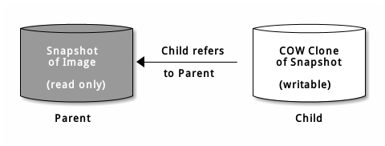
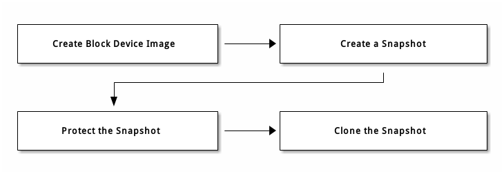
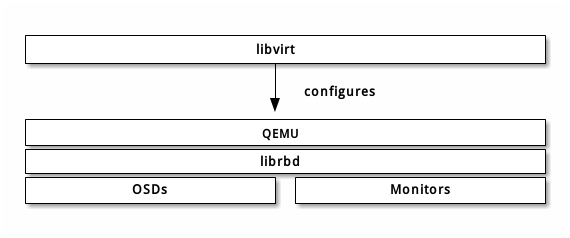
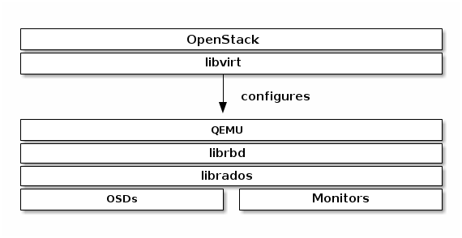

# Ceph 之块设备 - 命令，快照，镜像

### 一、Ceph 块设备

块是一个字节序列（例如，一个 512 字节的数据块）。基于块的存储接口是最常见的存储数据方法，例如硬盘、CD、软盘等。无处不在的块设备接口（block device interfaces）使 **虚拟块设备**（virtual block device）成为与 Ceph 这样的海量存储系统交互的理想之选。

Ceph 块设备是精简配置、大小可调的，将数据条带化存储到集群内的多个 OSD。 Ceph 块设备利用 RADOS 的多种能力，如快照、复制和一致性。

Ceph 的 RADOS 块设备（**Ceph's RADOS Block Devices, RBD**） 使用 **内核模块**（`kernel modules`）或 **librbd 库**（`librbd library`）与 OSD 交互。


> Note：内核模块可使用 Linux 页缓存（Linux page caching）。对基于 librbd 的应用程序， Ceph 支持 RBD 缓存（RBD Caching）。

### 二、块设备 rbd 命令

注：`{pool-name}` 为空时，为默认的 `rbd` 存储池。**映像** 指 **块设备映像 image**。

#### 1. 创建映像

```
rbd create --size {megabytes} {pool-name}/{image-name}
```

#### 2. 映像列表

```
rbd ls {pool-name}
rbd trash ls {poolname} //列出延迟删除块设备
```

#### 3. 查看详情

```
rbd info {pool-name}/{image-name}
```

#### 4. 调整大小

Ceph 块设备映像是精简配置，只有在你开始写入数据时它们才会占用物理空间。

```
rbd resize --size 2048 foo (to increase)
rbd resize --size 2048 foo --allow-shrink (to decrease)
```

#### 5. 删除映像

```
rbd rm {pool-name}/{image-name}
```

#### 6. 恢复映像

在rbd池中恢复延迟删除的块设备，需要 {image-id}

```
rbd trash restore {pool-name}/{image-id}
```

 

### 三、操作内核模块


#### 1. 获取映像列表

要挂载块设备映像，先罗列出所有的映像。

```
rbd ls {pool-name}
```

#### 2. 映射为块设备

**把映像映射为虚拟块设备**：用 `rbd map` 把 **映像名** 映射到 **内核模块**。rbd 内核模块会在此过程中自动加载。

```
sudo rbd map {pool-name}/{image-name} --id {user-name}
```

注：如果你启用了 `cephx` 认证，还必须提供密钥，可以用密钥环或密钥文件指定密钥：

```
sudo rbd map rbd/myimage --id admin --keyring /path/to/keyring
sudo rbd map rbd/myimage --id admin --keyfile /path/to/file
```

#### 3. 查看已映射的块设备

```
rbd showmapped
```

映射成功后就可以：

1.使用 **mkfs 命令** 将块设备构建化为文件系统：

```
sudo mkfs.xfs /dev/rbd/{pool-name}/{image-name}
```

2.使用 **mount 命令** 将文件系统挂载到某个路径下：

```
sudo mount /dev/rbd/{pool-name}/{image-name} /mnt/ceph-block-device
```

#### 4. 取消块设备映射

```
sudo rbd unmap /dev/rbd/{poolname}/{imagename} 
```

### 四、快照基础 rbd snap

快照是映像在某个特定时间点的一份只读副本。 Ceph 块设备的一个高级特性就是你可以为映像创建快照来保留其历史。 Ceph 还支持分层快照，让你快速、简便地克隆映像（如 VM 映像）。 Ceph 的快照功能支持 rbd 命令和多种高级接口，包括 QEMU 、 libvirt 、 OpenStack 和 CloudStack 。

注：如果启用了cephx（默认的），你必须指定用户名或 ID 、及其对应的密钥文件

```
rbd --id {user-ID} --keyring=/path/to/secret [commands]
rbd --name {username} --keyring=/path/to/secret [commands]
```

> Tip：把用户名和密钥写入 CEPH_ARGS 环境变量，这样就无需每次手动输入。

#### 1. 创建快照

用 rbd 命令创建快照，要指定 snap create 选项、存储池名和映像名。

```
rbd snap create {pool-name}/{image-name}@{snap-name}
```

#### 2. 快照列表

列出某个映像的快照，需要指定存储池名和映像名。

```
rbd snap ls {pool-name}/{image-name}
```

#### 3. 快照回滚

用 rbd 命令回滚到某一快照，指定 snap rollback 选项、存储池名、映像名和快照名。

```
rbd snap rollback {pool-name}/{image-name}@{snap-name}
```

#### 4. 删除快照

要用 rbd 删除一快照，指定 snap rm 选项、存储池名、映像名和快照名。

```
rbd snap rm {pool-name}/{image-name}@{snap-name}
```

#### 5. 删除某个映像的所有快照

要用 rbd 删除某个映像的所有快照，指定 snap purge 选项、存储池名和映像名。

```
rbd snap purge {pool-name}/{image-name} 
```

### 五、分层快照

Ceph 支持为某一设备快照创建很多个 **写时复制（ COW ）** 克隆。分层快照使得 Ceph 块设备客户端可以很快地创建映像。例如，你可以创建一个包含有 Linux VM 的块设备映像；然后做快照、保护快照，再创建任意多个写时复制克隆。快照是只读的，所以简化了克隆快照的语义 —— 使得克隆很迅速。



各个克隆出来的映像（子）都存储着对父映像的引用，这使得克隆出来的映像可以打开父映像并读取它。

一个快照的 COW 克隆和其它任何 Ceph 块设备映像的行为完全一样。克隆出的映像没有特别的限制，你可以读出、写入、克隆、调整克隆映像的大小。然而快照的写时复制克隆引用了快照，所以你克隆快照前必须保护它。下图描述了此过程。

**分层入门**

Ceph 块设备的分层是个简单的过程。你必须有个映像、必须为它创建快照、并且必须保护快照，执行过这些步骤后，你才能克隆快照。



克隆出的映像包含对父快照的引用，也包含存储池 ID 、映像 ID 和快照 ID 。

1.Image Temerate：映像模板

2.Extended Template：扩展模板

3.Template Pool：模板池

4.Image Migration/Recovery：模板迁移/恢复

#### 1. 保护快照

克隆映像要访问父快照。如果用户不小心删除了父快照，所有克隆映像都会损坏。为防止数据丢失，在克隆前必须先保护快照。你删除不了受保护的快照。

```
rbd snap protect {pool-name}/{image-name}@{snapshot-name}
```

#### 2. 克隆快照

```
rbd clone {pool-name}/{parent-image}@{snap-name} {pool-name}/{child-image-name}
```

#### 3. 取消快照保护

删除快照前，必须先取消保护。

```
rbd snap unprotect {pool-name}/{image-name}@{snapshot-name}
```

#### 4. 快照子孙列表

```
rbd children {pool-name}/{image-name}@{snapshot-name}
```

#### 5. 拍平快照

克隆出来的映像仍保留了对父快照的引用。要从子克隆删除这些到父快照的引用，你可以把快照的信息复制给子克隆，也就是“拍平”它。拍平克隆映像的时间随快照尺寸增大而增加。要删除快照，必须先拍平子映像。

```
rbd flatten {pool-name}/{image-name}
```

### 六、镜像 rbd mirror

可以在两个 Ceph 集群中异步备份 RBD images。该能力利用了 RBD image 的日志特性，以确保集群间的副本崩溃一致性。镜像功能需要在同伴集群（ peer clusters ）中的每一个对应的 pool 上进行配置，可设定自动备份某个存储池内的所有 images 或仅备份 images 的一个特定子集。用 rbd 命令来配置镜像功能。 rbd-mirror 守护进程负责从远端集群拉取 image 的更新，并写入本地集群的对应 image 中。

> Note：RBD 镜像功能需要 Ceph Jewel 或更新的发行版本。

> Important：要使用 RBD 镜像功能，你必须有 2 个 Ceph 集群， 每个集群都要运行 rbd-mirror 守护进程。

**存储池配置**

镜像功能是在 Ceph 集群内的存储池级别上配置的。

#### 1. 启用镜像

```
rbd mirror pool enable {pool-name} {mode}
```

镜像模式 mode 可以是 pool 或 image：

- pool：当设定为 pool 模式，存储池中所有开启了日志特性的 images 都会被备份。
- image：当设定为 image 模式，需要对每个 image 显式启用镜像功能。

#### 2. 禁用镜像功能

```
rbd mirror pool disable {pool-name}
```

#### 3. 添加同伴集群

为了使 rbd-mirror 守护进程发现它的同伴集群，需要向存储池注册。

```
rbd mirror pool peer add {pool-name} {client-name}@{cluster-name}
```

#### 4. 移除同伴集群

```
rbd mirror pool peer remove {pool-name} {peer-uuid}
```

**IMAGE配置**

不同于存储池配置，image 配置只需针对单个 Ceph 集群操作。

镜像 RBD image 被指定为主镜像或者副镜像。这是 image 而非存储池的特性。被指定为副镜像的 image 不能被修改。

当一个 image 首次启用镜像功能时（存储池的镜像模式设为 pool 且启用了该 image 的日志特性，或者通过 rbd 命令显式启用），它会自动晋升为主镜像。

#### 5. 启用 IMAGE 的日志支持

RBD 镜像功能使用了 RBD 日志特性，来保证 image 副本间的崩溃一致性。在备份 image 到另一个同伴集群前，必须启用日志特性。该特性可在使用 rbd 命令创建 image 时通过指定 --image-feature exclusive-lock,journaling 选项来启用。

或者，可以动态启用已有 image 的日志特性。

#### 6. 使用 rbd 开启日志特性

```
rbd feature enable {pool-name}/{image-name} {feature-name}
```

> Tip：你可以通过在 Ceph 配置文件中增加 rbd default features = 125 ，使得所有新建 image 默认启用日志特性。

#### 7. 启用 IMAGE 镜像功能

```
rbd mirror image enable {pool-name}/{image-name}
```

#### 8. 禁用 IMAGE 镜像功能

```
rbd mirror image disable {pool-name}/{image-name}
```

在需要把主名称转移到同伴 Ceph 集群这样一个故障切换场景中，应该停止所有对主 image 的访问（比如关闭 VM 的电源或移除 VM 的相关驱动），当前的主 image 降级为副，原副 image 升级为主，然后在备份集群上恢复对该 image 访问。

#### 9. 降级主 image

```
rbd mirror image demote {pool-name}/{image-name}
```

#### 10. 升级副 image

```
rbd mirror image promote {pool-name}/{image-name}
```

> Tip：由于主 / 副状态是对于每个 image 而言的，故可以让两个集群拆分 IO 负载来进行故障切换 / 故障自动恢复。

#### 11. 强制 IMAGE 重新同步

如果 rbd-daemon 探测到了脑裂事件，它在此情况得到纠正之前，是不会尝试去备份受到影响的 image。为了恢复对 image 的镜像备份，首先判定降级 image 已经过时，然后向主 image 请求重新同步。

```
rbd mirror image resync {pool-name}/{image-name} 
```

### 七、QEMU

Ceph 块设备最常见的用法之一是作为虚拟机的 **块设备映像** 。例如，用户可创建一个安装、配置好了操作系统和相关软件的“黄金标准”映像，然后对此映像做快照，最后再克隆此快照（通常很多次）。能制作快照的写时复制克隆意味着 Ceph 可以快速地为虚拟机提供块设备映像，因为客户端每次启动一个新虚拟机时不必下载整个映像。

QEMU 能把一主机上的块设备传递给客户机，但从 QEMU 0.15 起，不需要在主机上把映像映射为块设备了。QEMU 现在能**通过 librbd 直接把映像作为虚拟块设备访问**。这样性能更好，因为它避免了额外的上下文切换，而且能利用开启 RBD 缓存带来的好处。


#### 1. 安装

http://docs.ceph.org.cn/install/install-vm-cloud/

```
sudo yum install qemu-kvm qemu-kvm-tools qemu-img
```

#### 2. 使用

Ceph 块设备可以和 QEMU 虚拟机集成到一起。QEMU 命令行要求你指定 存储池名和映像名，还可以指定快照名。

QEMU 会假设 Ceph 配置文件位于默认位置（如 /etc/ceph/$cluster.conf ），并且你是以默认的 client.admin 用户执行命令，除非你另外指定了其它 Ceph 配置文件路径或用户（对应/etc/ceph/ceph.client.{ID}.keyring）。

```
qemu-img {command} [options] rbd:{pool-name}/{image-name}[@snapshot-name][:option1=value1][:option2=value2...]
```

例如，应该这样指定 id 和 conf 选项：

```
qemu-img {command} [options] rbd:{pool-name}/{image-name}:id=admin:conf=/etc/ceph/ceph.conf
//其中 :id=admin:conf=/etc/ceph/ceph.conf 是默认选项，可以省略
```

#### 3. 用 QEMU 创建块设备

```
qemu-img create -f raw rbd:{pool-name}/{image-name} {size}
```

> Important：raw 数据格式是使用 RBD 时的唯一可用 format 选项。

创建后，客户端可以直接通过 librbd 直接把映像作为 **虚拟块设备** `rbd:{pool-name}/{image-name}` 访问。

#### 4. 用 QEMU 调整块设备大小

```
qemu-img resize rbd:{pool-name}/{image-name} {size}
```

#### 5. 用 QEMU 查看块设备信息

```
qemu-img info rbd:{pool-name}/{image-name}
```

#### 6. 通过 RBD 运行 QEMU

你可以用 qemu-img 把已有的虚拟机映像转换为 Ceph 块设备映像。比如你有一个 qcow2 映像，可以这样转换：

```
qemu-img convert -f qcow2 -O raw debian_squeeze.qcow2 rbd:data/squeeze
```

要从那个映像启动虚拟机，执行：

```
qemu -m 1024 -drive format=raw,file=rbd:data/squeeze
```

启用 RBD 缓存可显著提升性能。从 QEMU 1.2 起， QEMU 的缓存选项可控制 librbd 缓存：

```
qemu -m 1024 -drive format=rbd,file=rbd:data/squeeze,cache=writeback
```

> Important：如果你设置了 rbd_cache=true ，那就必须设置 cache=writeback， 否则有可能丢失数据。不设置 cache=writeback ， QEMU 就不会向 librbd 发送回写请求。如果 QEMU 退出时未清理干净， rbd 之上的文件系统就有可能崩溃。

#### 7. 启用 DISCARD/TRIM 功能

从 Ceph 0.46 和 QEMU 1.1 起， Ceph 块设备支持 discard 操作。这意味着客户机可以发送 TRIM 请求来让 Ceph 块设备回收未使用的空间。此功能可在客户机上挂载 ext4 或 XFS 时加上 discard 选项。

//QEMU 缓存选项
QEMU 的缓存选项对应下列的 Ceph RBD 缓存选项。

回写：

```
rbd_cache = true
```

透写：

```
rbd_cache = true
rbd_cache_max_dirty = 0
```

无：

```
rbd_cache = false
```

QEMU 的缓存选项会覆盖 Ceph 的默认选项（就是那些 Ceph 配置文件里没有的选项）。如果你在 Ceph 配置文件内设置了 RBD 缓存选项，那么它们会覆盖 QEMU 缓存选项。如果你在 QEMU 命令行中设置了缓存选项，它们则会覆盖 Ceph 配置文件里的选项。

### 八、libvirt

下图解释了 libvirt 和 QEMU 如何通过 librbd 使用 Ceph 块设备。



libvirt 常见于为云解决方案提供 Ceph 块设备，像 OpenStack 、 ClouldStack 。它们用 libvirt 和 QEMU/KVM 交互、 QEMU/KVM 再通过 librbd 与 Ceph 块设备交互。 

### 九、Openstack

通过 libvirt 你可以把 Ceph 块设备用于 OpenStack ，它配置了 QEMU 到 librbd 的接口。 Ceph 把块设备映像条带化为对象并分布到集群中，这意味着大容量的 Ceph 块设备映像其性能会比独立服务器更好。

要把 Ceph 块设备用于 OpenStack ，必须先安装 QEMU 、 libvirt 和 OpenStack 。我们建议用一台独立的物理主机安装 OpenStack ，此主机最少需 8GB 内存和一个 4 核 CPU 。下面的图表描述了 OpenStack/Ceph 技术栈。

